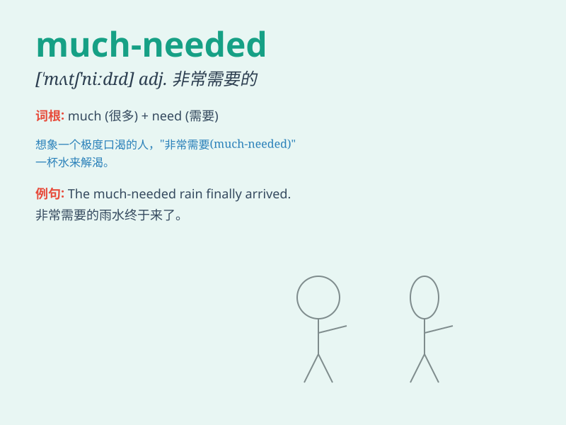

## much-needed

**英音:** _[mʌtʃ \'niːdid]_ **美音:** _[mʌtʃ \'nidɪd]_

**译义:** *adj.非常需要的，迫切需要的*

### 短语

+ **much-needed improvement:** _急需的改进_

+ **much-needed support:** _非常需要的支持_

+ **much-needed break:** _迫切需要的休息_

+ **much-needed rest:** _急需的休息_

+ **much-needed change:** _急需的改变_

### 例句

#### 例句1

> **The much-needed rain finally came, bringing relief to the parched
fields.**

**中文翻译:** 急需的雨水终于来了，给干涸的田地带来了缓解。

**单词释义:** 急需的

#### 例句2

> **The charity provided much-needed support to the homeless
people.**

**中文翻译:** 慈善机构为无家可归的人提供了急需的支持。

**单词释义:** 急需的

#### 例句3

> **The company is in desperate need of a much-needed injection of
capital.**

**中文翻译:** 这家公司极度需要一笔急需的资金注入。

**单词释义:** 急需的

### 背诵小故事

> Imagine a village suffering from a severe drought. Finally,
it迎来了一场 much-needed rain. The rain was desperately awaited and
brought relief and hope. Just like this rain, the word \'much-needed\'
means very necessary or greatly desired.

**想象一个村庄遭受严重干旱。最终，它迎来了一场急需的雨。这场雨是迫切等待的，并带来了缓解和希望。就像这场雨一样，'much-needed'这个词意味着非常必要或极其渴望的。**

### 图义

