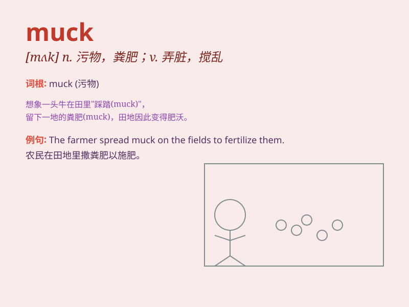

## muck

**英音:** _[mʌk]_ **美音:** _[mʌk]_

**译义:** *n.粪肥,垃圾,肥料vt.施肥,弄脏,捣乱,搞坏vi.鬼混*

### 短语

+ **muck about:** _游手好闲；闲荡_

+ **muck in:** _一起干活；共同分担_

+ **muck out:** _打扫（马厩等）_

+ **muck up:** _搞糟；弄乱_

+ **muck around:** _浪费时间；胡闹_

### 例句

#### 例句1

> **The farmer spread muck on the fields to fertilize the soil.**

**中文翻译:** 农民把泥土撒在田里，给土壤施肥。

**单词释义:** 粪肥

#### 例句2

> **He had to muck out the stables.**

**中文翻译:** 他不得不清理马厩。

**单词释义:** 粪便

#### 例句3

> **Don\'t muck up my room!**

**中文翻译:** 别把我的房间弄脏了！

**单词释义:** 弄脏；弄乱

### 背诵小故事

> A farmer was cleaning the muck in the barn. The muck, which was a
mixture of dirt and animal waste, was very smelly. But after the
cleaning, the barn became clean and tidy.

**一位农民正在清理谷仓里的粪便垃圾。这些粪便垃圾，是泥土和动物粪便的混合物，非常臭。但清理之后，谷仓变得干净整洁了。**

### 图义

