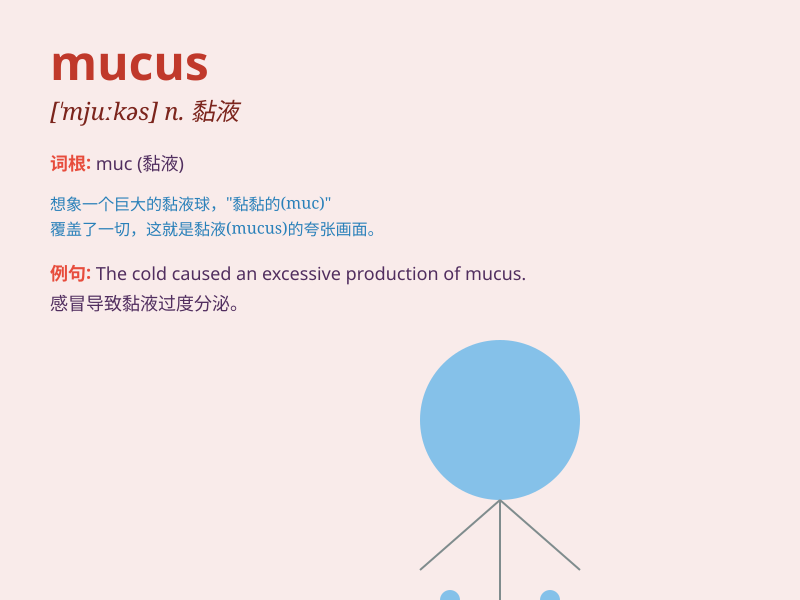

## mucus

**英音:** _[\'mjuːkəs]_ **美音:** _[\'mjukəs]_

**译义:** *n.粘液,胶*

### 短语

+ **nasal mucus:** _鼻黏液_

+ **mucus membrane:** _黏膜_

+ **mucus secretion:** _黏液分泌_

+ **thick mucus:** _浓稠的黏液_

+ **excessive mucus:** _过多的黏液_

### 例句

#### 例句1

> **The patient coughed up mucus.**

**中文翻译:** 病人咳出粘液。

**单词释义:** 黏液

#### 例句2

> **His nose was blocked with mucus.**

**中文翻译:** 他的鼻子被粘液堵住了。

**单词释义:** 黏液

#### 例句3

> **The mucus in her throat made it difficult to speak.**

**中文翻译:** 喉咙里的粘液让她说话变得困难。

**单词释义:** 黏液

### 背诵小故事

> A little bug was trapped in a cave full of sticky mucus. It struggled
to get out but the mucus was too thick. Finally, with great effort, it
escaped. Remember, mucus is that thick and sticky substance.

**一只小虫子被困在一个充满黏糊糊黏液的洞穴里。它努力想出去，但黏液太浓稠了。最后，费了好大劲它才逃脱。记住，mucus
就是那种浓稠的黏性物质。**

### 图义

