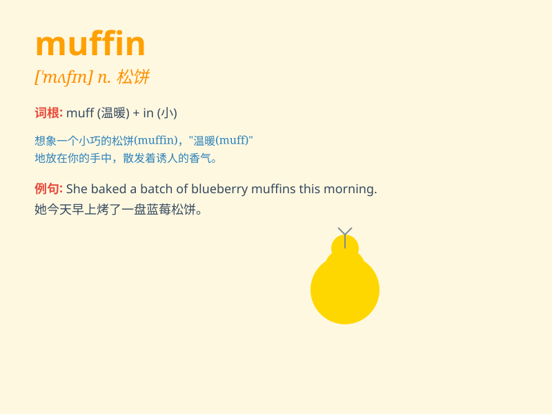

## muffin

**英音:** _[\'mʌfɪn]_ **美音:** _[\'mʌfɪn]_

**译义:** *n.松饼*

### 短语

+ **blueberry muffin:** _蓝莓松饼_

+ **chocolate muffin:** _巧克力松饼_

+ **muffin pan:** _松饼烤盘_

+ **muffin top:** _腰间赘肉_

+ **banana muffin:** _香蕉松饼_

### 例句

#### 例句1

> **I had a blueberry muffin for breakfast.**

**中文翻译:** 我早餐吃了一个蓝莓松饼。

**单词释义:** 松饼

#### 例句2

> **The muffin was still warm from the oven.**

**中文翻译:** 刚出炉的松饼还是热的。

**单词释义:** 松饼

#### 例句3

> **She baked some chocolate muffins for the party.**

**中文翻译:** 她为聚会烤了一些巧克力松饼。

**单词释义:** 松饼

### 背诵小故事

> One day, a little girl was very hungry. Her mom baked some delicious
muffin. The muffin was soft and sweet. The girl ate it happily and felt
full.

**有一天，一个小女孩非常饿。她的妈妈烤了一些美味的玛芬蛋糕。玛芬蛋糕又软又甜。小女孩开心地吃了，觉得饱饱的。**

### 图义

