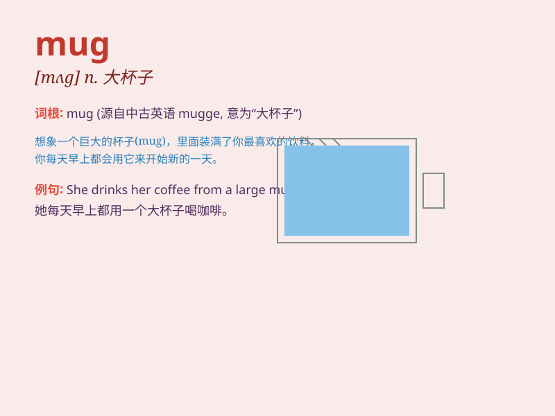

## mug

**英音:** _[mʌg]_ **美音:** _[mʌɡ]_

**译义:** *n.大杯子, 面容, 一杯的量, 陶瓷杯; vt.抢劫, 殴打,
用杯子饮; vi. 用杯子喝*

### 例句

#### 例句1

> **He was mugged by two men on his way home.**

**中文翻译:** 他在回家的路上被两个男人抢劫了。

**单词释义:** 抢劫

#### 例句2

> **She bought a new mug for her morning coffee.**

**中文翻译:** 她为早上喝咖啡买了一个新马克杯。

**单词释义:** 马克杯

#### 例句3

> **His face looked like a mug shot.**

**中文翻译:** 他的脸看起来像一张面部照片。

**单词释义:** 面部照片

### 背诵小故事

> One day, a thief broke into a house and stole a mug. But he was so
nervous that he dropped the mug and made a loud noise. The owner woke up
and caught him. Remember, a mug is a cup, usually with a handle.

**一天，一个小偷闯进一间房子偷了一个马克杯。但他太紧张了，把马克杯弄掉并发出很大的声响。主人醒了并抓住了他。记住，mug
就是杯子，通常有把手。**

### 图义

