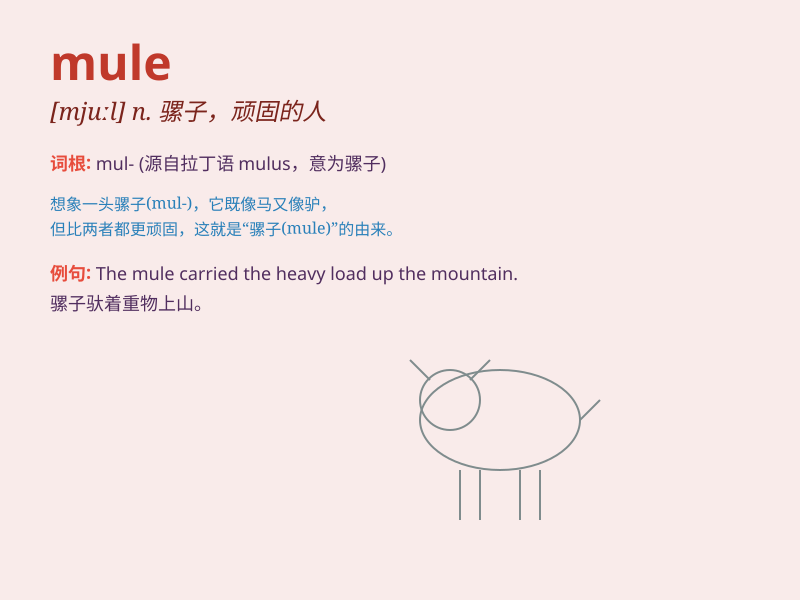

## mule

**英音:** _[mjuːl]_ **美音:** _[mjul]_

**译义:** *n.骡,倔强之人,顽固的人,杂交种动物*

### 短语

+ **pack mule:** _驮骡_

+ **mule deer:** _黑尾鹿_

+ **mule spinner:** _走锭纺纱机_

+ **stubborn as a mule:** _非常顽固_

+ **mule track:** _骡道_

### 例句

#### 例句1

> **The mule carried heavy loads across the mountains.**

**中文翻译:** 骡子驮着重物翻山越岭。

**单词释义:** 骡子

#### 例句2

> **She wore a pair of mule shoes.**

**中文翻译:** 她穿着一双穆勒鞋。

**单词释义:** 后跟无带的女鞋

#### 例句3

> **He is as stubborn as a mule.**

**中文翻译:** 他像骡子一样固执。

**单词释义:** 骡子（比喻固执的人）

### 背诵小故事

> A man was traveling in the desert and his horse got injured. Luckily,
he found a mule to carry his heavy bags. The mule was strong and
stubborn but finally helped him reach his destination.

**一个人在沙漠中旅行，他的马受伤了。幸运的是，他找到了一头骡子来驮他沉重的袋子。骡子很强壮但也很倔强，最终还是帮助他到达了目的地。**

### 图义

