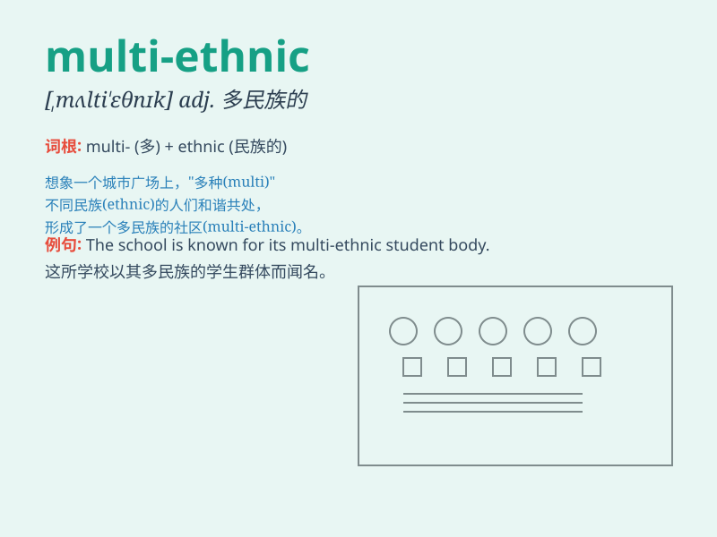

## multi-ethnic

**英音:** _[ˌmʌltiˈɪθnɪk]_ **美音:** _[ˌmʌl.tiˈeθ.nɪk]_

**译义:** *多民族的；多种族的*

### 短语

+ **multi-ethnic society:** _多民族社会_

+ **multi-ethnic country:** _多民族国家_

+ **multi-ethnic community:** _多民族社区_

+ **multi-ethnic region:** _多民族地区_

+ **multi-ethnic culture:** _多民族文化_

### 例句

#### 例句1

> **The city is a multi-ethnic melting pot, with people from various
backgrounds living together peacefully.**

**中文翻译:**
这座城市是一个多民族的大熔炉，来自不同背景的人们和平地生活在一起。

**单词释义:** 多民族的

#### 例句2

> **Our school is a multi-ethnic institution that promotes cultural
diversity.**

**中文翻译:** 我们的学校是一所促进文化多样性的多民族学校。

**单词释义:** 多民族的

#### 例句3

> **The multi-ethnic community held a festival to celebrate their
unity.**

**中文翻译:** 这个多民族社区举办了一个节日来庆祝他们的团结。

**单词释义:** 多民族的

### 背诵小故事

> Imagine a big city where people from many different ethnic groups
live together happily. They have different customs, but they respect
each other. This city is a multi-ethnic place, full of diversity and
harmony.

**想象一个大城市，来自许多不同民族的人们愉快地生活在一起。他们有着不同的习俗，但相互尊重。这个城市就是一个多民族的地方，充满了多样性与和谐。**

### 图义

