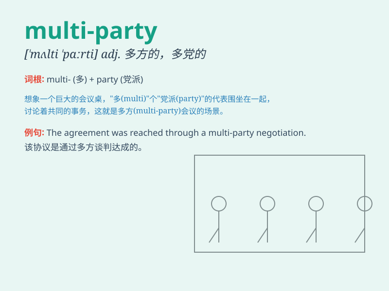

## multi-party

**英音:** _[ˈmʌlti ˈpɑːrti]_ **美音:** _[ˈmʌlti
ˈpɑːrti]_

**译义:** *adj. 多党的；多方的；多党派的*

### 短语

+ **multi-party system:** _多党制_

+ **multi-party democracy:** _多党民主_

+ **multi-party agreement:** _多党协议_

+ **multi-party negotiation:** _多党协商_

+ **multi-party collaboration:** _多党合作_

### 例句

#### 例句1

> **The multi-party system ensures a diverse range of political
opinions.**

**中文翻译:** 多党制确保了政治意见的多样化范围。

**单词释义:** 多党的

#### 例句2

> **We are in a multi-party negotiation to solve the problem.**

**中文翻译:** 我们正在进行多党谈判以解决这个问题。

**单词释义:** 多党的

#### 例句3

> **The multi-party conference was held successfully.**

**中文翻译:** 多党会议成功举行。

**单词释义:** 多党的

### 背诵小故事

> Imagine a big party with many different groups of people. Each group
has its own ideas and plans. This is like a multi-party situation, where
there are multiple parties involved.

**想象一个盛大的派对，有许多不同的人群。每个群体都有自己的想法和计划。这就像是多党制的情况，有多个党派参与。**

### 图义

