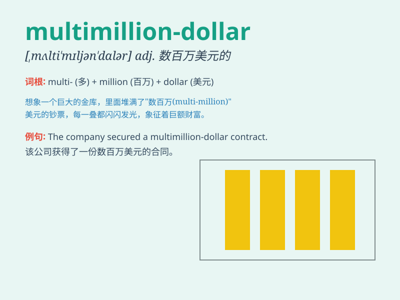

## multimillion-dollar

**英音:** _[ˌmʌltiˈmɪljən ˈdɒlə(r)]_ **美音:**
_[ˌmʌl.tiˈmɪl.jən ˈdɑː.lər]_

**译义:**
*形容词，表示价值数百万美元的，通常用来描述某物或某人的经济价值非常高*

### 短语

+ **multimillion-dollar deal:** _数百万美元的交易_

+ **multimillion-dollar project:** _数百万美元的项目_

+ **multimillion-dollar company:** _数百万美元的公司_

+ **multimillion-dollar investment:** _数百万美元的投资_

+ **multimillion-dollar lawsuit:** _数百万美元的诉讼_

### 例句

#### 例句1

> **The company launched a multimillion-dollar marketing campaign to
promote its new product.**

**中文翻译:** 这家公司发起了一场数百万美元的营销活动来推广其新产品。

**单词释义:** 数百万美元的（用于形容营销活动的规模）

#### 例句2

> **The multimillion-dollar mansion is located in the most exclusive
neighborhood.**

**中文翻译:** 这座价值数百万美元的豪宅位于最独特的社区。

**单词释义:** 数百万美元的（用于形容豪宅的价值）

#### 例句3

> **They won a multimillion-dollar lawsuit against the giant
corporation.**

**中文翻译:** 他们赢得了一场针对那家大公司的数百万美元的诉讼。

**单词释义:** 数百万美元的（用于形容诉讼所涉及的金额）

### 背诵小故事

> A young entrepreneur had a multimillion-dollar idea. He worked hard
and finally his startup became a multimillion-dollar business. This
success made him a role model for many.

**一位年轻的企业家有了一个价值数百万美元的想法。他努力工作，最终他的初创公司成为了一家价值数百万美元的企业。这次成功使他成为了许多人的榜样。**

### 图义

