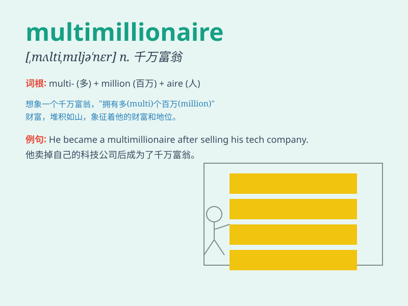

## multimillionaire

**英音:** _[,mʌltɪmɪljə\'neə]_ **美音:**
_[ˌmʌltiˌmɪljəˈnɛr, -taɪ-]_

**译义:** *n.拥有数百万家财的富豪,千万富翁*

### 短语

+ **become a multimillionaire:** _成为一位千万富翁_

+ **multimillionaire lifestyle:** _千万富翁的生活方式_

+ **multimillionaire entrepreneur:** _千万富翁企业家_

+ **multimillionaire fortune:** _千万富翁的财富_

+ **multimillionaire investor:** _千万富翁投资者_

### 例句

#### 例句1

> **He became a multimillionaire through his successful tech
business.**

**中文翻译:** 他通过成功的科技业务成为了千万富翁。

**单词释义:** 千万富翁

#### 例句2

> **The party was attended by several multimillionaires.**

**中文翻译:** 几位千万富翁参加了聚会。

**单词释义:** 千万富翁

#### 例句3

> **She married a multimillionaire and now leads a luxurious
life.**

**中文翻译:** 她嫁给了一位千万富翁，现在过着奢侈的生活。

**单词释义:** 千万富翁

### 背诵小故事

> A poor boy dreamed of becoming a multimillionaire. He worked hard,
took risks, and finally his business succeeded. With millions in wealth,
he fulfilled his dream. Now he enjoys a luxurious life.

**一个贫穷的男孩梦想成为千万富翁。他努力工作，敢于冒险，最终他的生意成功了。拥有数百万财富，他实现了梦想。现在他享受着奢华的生活。**

### 图义

