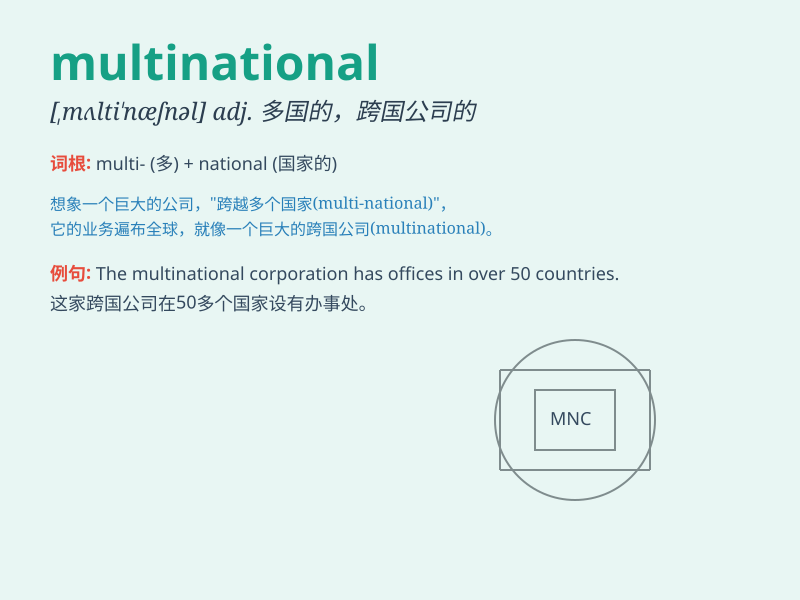

## multinational

**英音:** _[mʌltɪ\'næʃ(ə)n(ə)l]_ **美音:**
_[,mʌltɪ\'næʃnəl]_

**译义:** *adj.多国的,跨国公司的,多民族的n.多国籍公司,跨国公司*

### 短语

+ **multinational company:** _跨国公司_

+ **multinational corporation:** _跨国企业_

+ **multinational enterprise:** _跨国公司；多国企业_

+ **multinational business:** _跨国业务_

+ **multinational operation:** _跨国经营；多国经营_

### 例句

#### 例句1

> **The multinational company has branches all over the world.**

**中文翻译:** 这家跨国公司在世界各地设有分支机构。

**单词释义:** 跨国的

#### 例句2

> **He works for a large multinational corporation.**

**中文翻译:** 他在一家大型跨国公司工作。

**单词释义:** 跨国的

#### 例句3

> **The multinational conference was held in Beijing.**

**中文翻译:** 多国会议在北京举行。

**单词释义:** 跨国的

### 背诵小故事

> A man wanted to start a business. He found partners from many
countries. They formed a MULTINATIONAL company. It means having
operations and people from multiple nations.

**一个男人想要创业。他找到了来自许多国家的合作伙伴。他们成立了一家跨国公司。这个单词的意思是具有多个国家的业务和人员。**

### 图义

