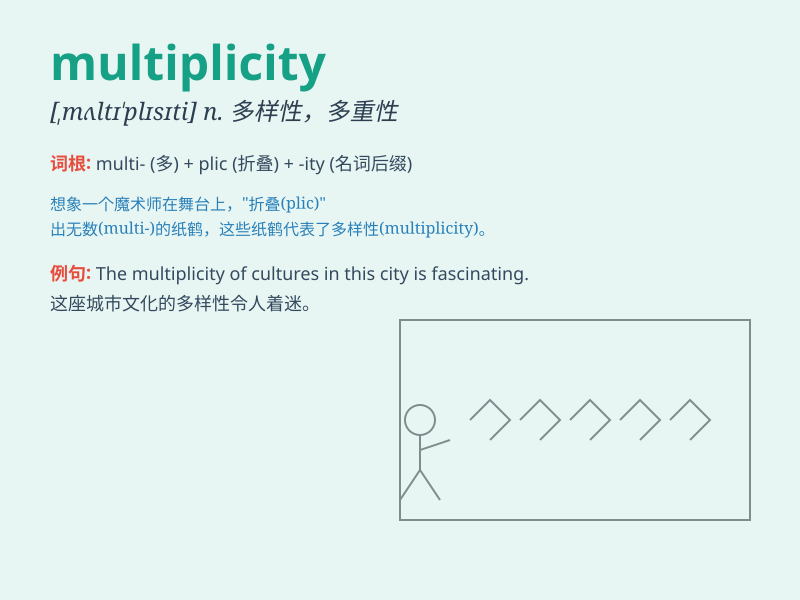

## multiplicity

**英音:** _[,mʌltɪ\'plɪsɪtɪ]_ **美音:**
_[,mʌltɪ\'plɪsəti]_

**译义:** *n.多样性*

### 短语

+ **multiplicity of factors:** _多种因素_

+ **a multiplicity of choices:** _多种选择_

+ **multiplicity of forms:** _多种形式_

+ **multiplicity of meanings:** _多种含义_

+ **in multiplicity:** _多种多样地_

### 例句

#### 例句1

> **The multiplicity of options can be overwhelming when choosing a
vacation destination.**

**中文翻译:** 在选择度假目的地时，选择的多样性可能令人眼花缭乱。

**单词释义:** 多样性；多种多样

#### 例句2

> **The multiplicity of tasks at work makes it difficult to focus on
one thing at a time.**

**中文翻译:** 工作任务的多样性使得一次很难专注于一件事。

**单词释义:** 多样性；多种

#### 例句3

> **The multiplicity of species in the rainforest is astonishing.**

**中文翻译:** 雨林中物种的多样性令人震惊。

**单词释义:** 多样性；繁多

### 背诵小故事

>
想象一个神奇的花园，里面有各种各样的花朵，数量繁多（multiplicity）。红的、黄的、紫的，每种颜色和品种都有好多。这个花园就展现了\'multiplicity\'所代表的多样性和大量的特点。

**想象一个充满多种花朵的神奇花园来辅助记忆\'multiplicity\'，表示多样性和大量**

### 图义

