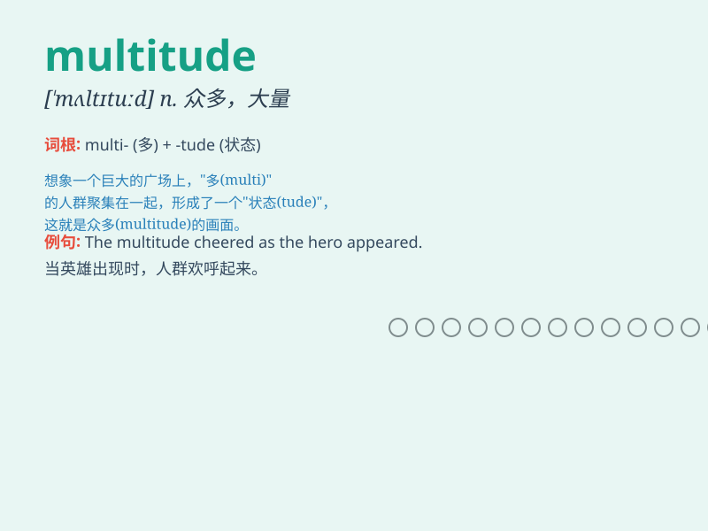

## multitude

**英音:** _[\'mʌltɪtjuːd]_ **美音:** _[ˈmʌltɪˌtud,
-ˌtjud]_

**译义:** *n.多数,群众*

### 短语

+ **a multitude of:** _大量的；众多的_

+ **multitudes of:** _大批的；众多的_

+ **in multitude:** _大批；众多_

+ **multitude consciousness:** _群体意识_

+ **multitude state:** _多众状态_

### 例句

#### 例句1

> **A multitude of people gathered in the square for the
celebration.**

**中文翻译:** 广场上聚集了很多人来庆祝。

**单词释义:** 众多；大量

#### 例句2

> **The problems facing the country are numerous, but a multitude of
solutions are possible.**

**中文翻译:** 该国面临的问题很多，但解决方案也有多种。

**单词释义:** 大量；众多

#### 例句3

> **She was overwhelmed by the multitude of tasks she had to
complete.**

**中文翻译:** 她被必须完成的众多任务压垮了。

**单词释义:** 众多；大量

### 背诵小故事

>
想象一下，在一个巨大的广场上，有成千上万的人（multitude）在参加庆祝活动。他们来自不同的地方，有着不同的肤色和服饰，但都充满了喜悦。这么多人聚集在一起，形成了一个庞大的群体，这就是
multitude 的场景。

**想象在广场上有成千上万的人参加活动来辅助记忆 multitude
这个表示众多、大量的单词**

### 图义

