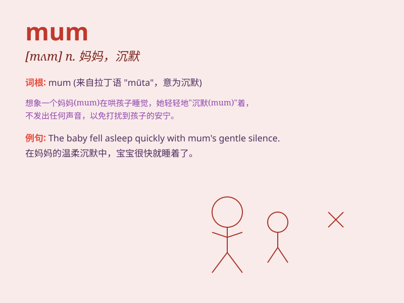

## mum

**英音:** _[mʌm]_ **美音:** _[mʌm]_

**译义:**
*n.[植](=chrysanthemum)菊花,沉默adj.沉默的vi.演哑剧int.别说话!*

### 短语

+ **keep mum:** _保持沉默；守口如瓶_

+ **mum\'s the word:** _保守秘密；别声张_

+ **stay mum:** _保持沉默；不说话_

+ **mum and dad:** _父母；爸爸妈妈_

+ **mum\'s boy:** _离不开母亲的男孩；没有男子气概的男孩_

### 例句

#### 例句1

> **My mum is a great cook.**

**中文翻译:** 我妈妈是一位出色的厨师。

**单词释义:** 母亲

#### 例句2

> **Don\'t tell Mum about this.**

**中文翻译:** 别告诉妈妈这件事。

**单词释义:** 妈妈

#### 例句3

> **Mum, I\'m home.**

**中文翻译:** 妈妈，我回来了。

**单词释义:** 妈妈（用于直接称呼）

### 背诵小故事

> A little girl was lost in the park. She was very scared and started
crying. \'Mum, where are you?\' she shouted. Finally, her mum found her
and gave her a big hug. The word\'mum\' represents the person who always
loves and protects us.

**一个小女孩在公园迷路了。她非常害怕，开始哭起来。'妈妈，你在哪里？'她喊道。最后，她的妈妈找到了她，并给了她一个大大的拥抱。单词'mum'代表着那个永远爱我们、保护我们的人。**

### 图义

