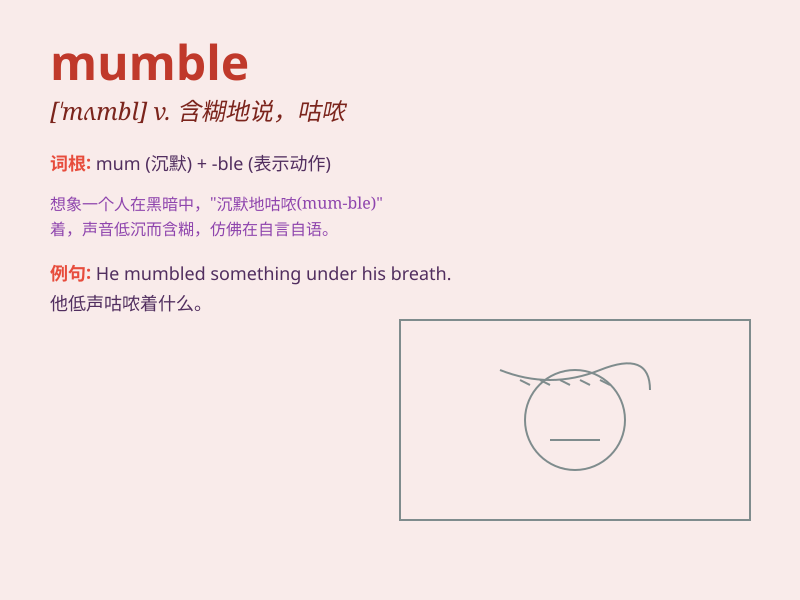

## mumble

**英音:** _[\'mʌmb(ə)l]_ **美音:** _[\'mʌmbl]_

**译义:** *n.喃喃而语,咕哝,闭嘴细嚼v.喃喃而语,咕哝*

### 短语

+ **mumble something to oneself:** _喃喃自语某事_

+ **mumble incoherently:** _含混不清地嘟囔_

+ **mumble under one\'s breath:** _低声嘟囔_

+ **mumble an apology:** _嘟囔着道歉_

+ **mumble a reply:** _嘟囔着回答_

### 例句

#### 例句1

> **He mumbled something under his breath that I couldn\'t
understand.**

**中文翻译:** 他低声咕哝了一些我听不懂的话。

**单词释义:** 低声含糊地说

#### 例句2

> **She mumbled an apology and quickly left the room.**

**中文翻译:** 她低声道歉，然后迅速离开了房间。

**单词释义:** 咕哝；含糊地说

#### 例句3

> **The old man mumbled to himself as he walked along the street.**

**中文翻译:** 老人一边走在街上，一边自言自语。

**单词释义:** 嘟囔；低声自语

### 背诵小故事

> 有一天，小明在课堂上被老师点名回答问题，他因为紧张而 mumble
不清，嘴里含糊地说着一些谁也听不懂的话。老师皱起眉头让他大声清晰地表达，小明这才努力克服紧张，清楚地回答了问题。

**有一天，小明在课堂上被老师点名回答问题，他因为紧张而含糊不清地说话，嘴里含糊地说着一些谁也听不懂的话。老师皱起眉头让他大声清晰地表达，小明这才努力克服紧张，清楚地回答了问题。**

### 图义

