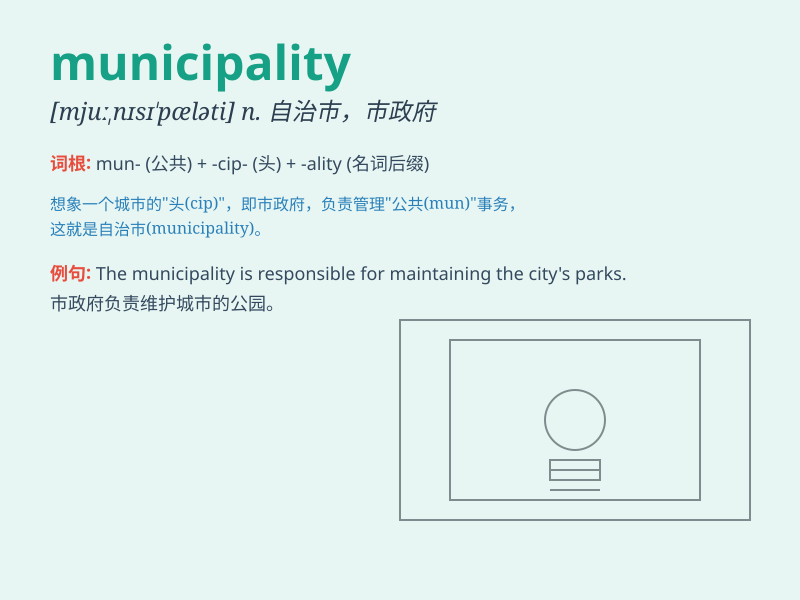

## municipality

**英音:** _[mjʊ,nɪsɪ\'pælɪtɪ]_ **美音:**
_[mjʊ\'nɪsə\'pæləti]_

**译义:** *n.市政当局,自治市*

### 短语

+ **municipal government:** _市政府_

+ **municipal bond:** _市政债券_

+ **municipal services:** _市政服务_

+ **municipal law:** _市政法_

+ **municipal election:** _市政选举_

### 例句

#### 例句1

> **The municipality is responsible for maintaining public parks and
gardens.**

**中文翻译:** 市政府负责维护公园和花园。

**单词释义:** 市政府

#### 例句2

> **This municipality has implemented strict environmental protection
measures.**

**中文翻译:** 本市实施了严格的环境保护措施。

**单词释义:** 自治市

#### 例句3

> **The problems of traffic congestion in the municipality need to be
addressed urgently.**

**中文翻译:** 我市交通拥堵问题亟待解决。

**单词释义:** 市

### 背诵小故事

> A traveler got lost in a strange place. When asking for help, a local
said, \'This is a municipality with many services.\' The traveler
finally understood it was a self-governing town.

**一位旅行者在一个陌生的地方迷路了。当寻求帮助时，一个当地人说：'这是一个自治市，有很多服务。'旅行者终于明白这是一个自治城镇。**

### 图义

