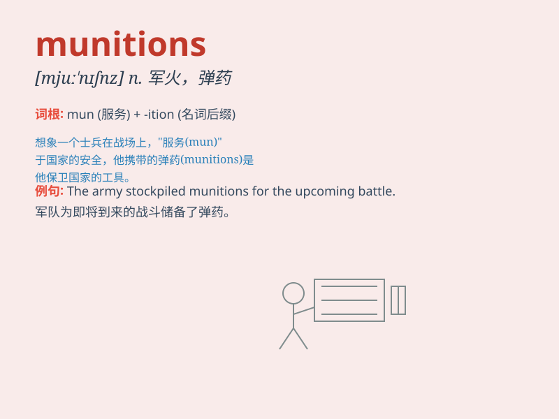

## munitions

**英音:** _[mjuːˈnɪʃnz]_ **美音:** _[mjuːˈnɪʃnz]_

**译义:** *n.pl.军需品(munition之复数)*

### 短语

+ **munitions factory:** _军工厂_

+ **munitions depot:** _军火库_

+ **munitions supply:** _军火供应_

+ **conventional munitions:** _常规军火_

+ **munitions expert:** _军火专家_

### 例句

#### 例句1

> **The country was accused of supplying munitions to the enemy.**

**中文翻译:** 该国被指控向敌人提供军火。

**单词释义:** 军火；弹药

#### 例句2

> **The factory was dedicated to the production of munitions during
the war.**

**中文翻译:** 该工厂在战争期间专门生产弹药。

**单词释义:** 军火；弹药

#### 例句3

> **They were in charge of transporting the munitions to the front
line.**

**中文翻译:** 他们负责将弹药运送到前线。

**单词释义:** 军火；弹药

### 背诵小故事

> During the war, a brave soldier was in charge of safeguarding the
munitions. These munitions were crucial for their army\'s victory. He
protected them with all his might, knowing they were the key to success.

**在战争期间，一位勇敢的士兵负责保卫军需品。这些军需品对他们军队的胜利至关重要。他竭尽全力保护它们，深知它们是成功的关键。**

### 图义

