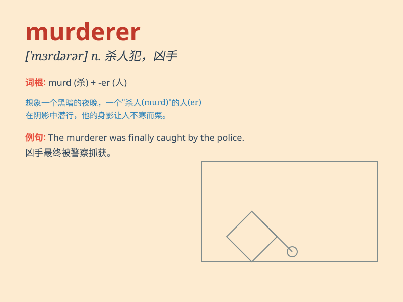

## murderer

**英音:** _[\'mɜːd(ə)rə(r)]_ **美音:** _[\'mɝdərɚ]_

**译义:** *n.杀人犯,凶手*

### 短语

+ **serial murderer:** _连环杀手_

+ **cold-blooded murderer:** _冷血杀手_

+ **notorious murderer:** _臭名昭著的凶手_

+ **convicted murderer:** _已定罪的杀人犯_

+ **fugitive murderer:** _逃犯凶手_

### 例句

#### 例句1

> **The police are hunting for the murderer who committed the brutal
crime.**

**中文翻译:** 警方正在追捕犯下这起残酷罪行的凶手。

**单词释义:** 凶手

#### 例句2

> **The murderer was sentenced to life imprisonment.**

**中文翻译:** 凶手被判处无期徒刑。

**单词释义:** 凶手

#### 例句3

> **The identity of the murderer remained a mystery for years.**

**中文翻译:** 多年来，凶手的身份一直是个谜。

**单词释义:** 凶手

### 背诵小故事

> One dark night, a figure sneaked into a house. With a sharp knife in
hand, he committed a heinous crime. This evil person was a murderer.
Later, the police caught him.

**在一个漆黑的夜晚，一个身影潜入一所房子。他手持锋利的刀，犯下了滔天罪行。这个邪恶的人就是凶手。后来，警察抓住了他。**

### 图义

