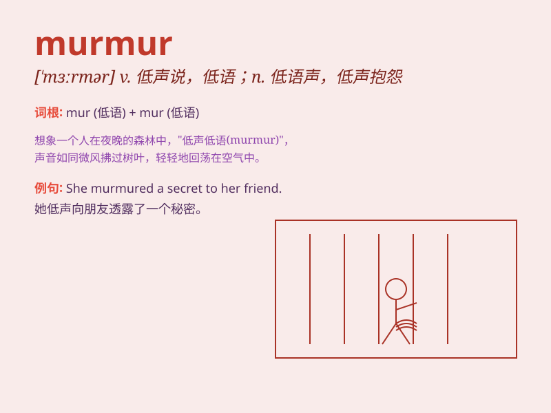

## murmur

**英音:** _[\'mɜːmə]_ **美音:** _[\'mɝmɚ]_

**译义:**
*n.低沉连续的声音,咕哝,怨言,低语v.发低沉连续的声音,发怨言,低声说,低语*

### 短语

+ **murmur against:** _小声抱怨；私下埋怨_

+ **murmur of complaint:** _抱怨声_

+ **murmur softly:** _轻声低语_

+ **murmur in sleep:** _在睡梦中嘟囔_

+ **constant murmur:** _持续的低语_

### 例句

#### 例句1

> **She murmured something under her breath.**

**中文翻译:** 她低声嘀咕了一句什么。

**单词释义:** 低声说，轻声说

#### 例句2

> **The stream murmured as it flowed through the forest.**

**中文翻译:** 溪水潺潺地流过森林。

**单词释义:** 发出低沉连续的声音

#### 例句3

> **He murmured his dissatisfaction with the decision.**

**中文翻译:** 他低声表达了对这个决定的不满。

**单词释义:** 咕哝，抱怨

### 背诵小故事

> A little mouse was murmuring in a corner of the room. It was
complaining about not finding enough food. But its murmurs were too soft
for others to notice.

**一只小老鼠在房间的角落里轻声低语。它在抱怨找不到足够的食物。但它的低语声太轻了，其他人都没注意到。**

### 图义

