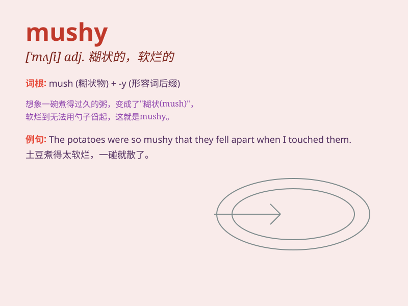

## mushy

**英音:** _[\'mʌʃɪ]_ **美音:** _[\'mʌʃi]_

**译义:** *adj.糊状的,玉米粥状的*

### 短语

+ **mushy peas:** _豌豆糊_

+ **mushy food:** _软烂的食物_

+ **mushy love story:** _过于浪漫伤感的爱情故事_

+ **mushy feelings:** _多愁善感_

+ **mushy consistency:** _糊状的稠度_

### 例句

#### 例句1

> **The fruit was too mushy to eat.**

**中文翻译:** 水果太糊了，吃不了。

**单词释义:** 软而稠糊的

#### 例句2

> **Her love letters were all mushy and sentimental.**

**中文翻译:** 她的情书都是糊涂而感伤的。

**单词释义:** 过分多情的；伤感的

#### 例句3

> **The vegetables turned mushy when cooked for too long.**

**中文翻译:** 蔬菜煮得太久就会变成糊状。

**单词释义:** 软烂的

### 背诵小故事

> One day, I was making a cake. But I added too much water, and the
cake became mushy. It was not firm or solid at all. It was soft and
soggy like a wet sponge.

**有一天，我在做蛋糕。但我加了太多水，蛋糕变得糊状。它一点也不结实或坚固。它软塌塌的，像一块湿海绵。**

### 图义

