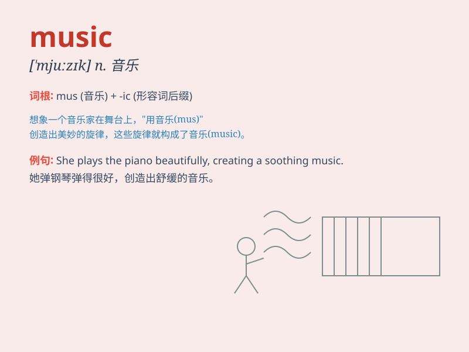

## music

**英音:** _[\'mjuːzɪk]_ **美音:** _[\'mjuzɪk]_

**译义:** *n.音乐,乐曲*

### 短语

+ **pop music:** _流行音乐_

+ **classical music:** _古典音乐_

+ **music festival:** _音乐节_

+ **music lover:** _音乐爱好者_

+ **background music:** _背景音乐_

### 例句

#### 例句1

> **I love listening to music when I\'m feeling stressed.**

**中文翻译:** 当我感到压力时，我喜欢听音乐。

**单词释义:** 音乐

#### 例句2

> **The music at the party was very lively.**

**中文翻译:** 晚会上的音乐非常热闹。

**单词释义:** 音乐

#### 例句3

> **She has a great talent for playing music.**

**中文翻译:** 她在音乐演奏方面有着出色的天赋。

**单词释义:** 音乐

### 背诵小故事

> One day, a little girl was lost in a forest. Suddenly, she heard
beautiful MUSIC. It was like a guiding light. She followed the sound and
found her way home. The music was so magical!

**有一天，一个小女孩在森林里迷路了。突然，她听到了美妙的音乐。它就像一道指路的光。她跟着声音找到了回家的路。这音乐太神奇了！**

### 图义

