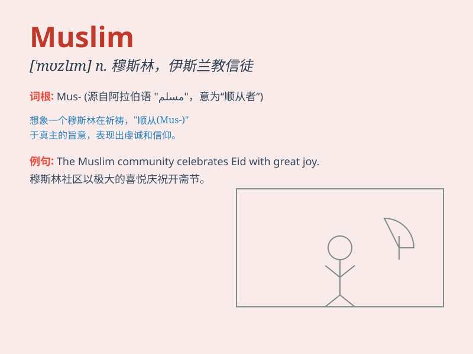

## Muslim

**英音:** _[ˈmʊzlɪm]_ **美音:** _[ˈmʊzlɪm]_

**译义:** *n.穆斯林；伊斯兰教信徒； adj.穆斯林的；伊斯兰教的*

### 短语

+ **Muslim community:** _穆斯林社区_

+ **Muslim country:** _穆斯林国家_

+ **Muslim faith:** _穆斯林信仰_

+ **Muslim population:** _穆斯林人口_

+ **Muslim world:** _穆斯林世界_

### 例句

#### 例句1

> **He is a devout Muslim and prays five times a day.**

**中文翻译:** 他是一个虔诚的穆斯林，每天祈祷五次。

**单词释义:** 穆斯林（指信仰伊斯兰教的人）

#### 例句2

> **The city has a significant Muslim population.**

**中文翻译:** 这个城市有相当数量的穆斯林人口。

**单词释义:** 穆斯林

#### 例句3

> **Muslim customs and traditions are respected in this country.**

**中文翻译:** 在这个国家，穆斯林的习俗和传统受到尊重。

**单词释义:** 穆斯林

### 背诵小故事

> One day, I met a kind person named Ahmed. He told me he was a Muslim
and followed the teachings of Islam. He prayed five times a day and was
very devout. I learned that Muslims have deep faith and respect for
their religion.

**有一天，我遇到了一个善良的人叫艾哈迈德。他告诉我他是一名穆斯林，遵循伊斯兰教的教义。他每天祈祷五次，非常虔诚。我了解到穆斯林对他们的宗教有着深厚的信仰和尊重。**

### 图义

