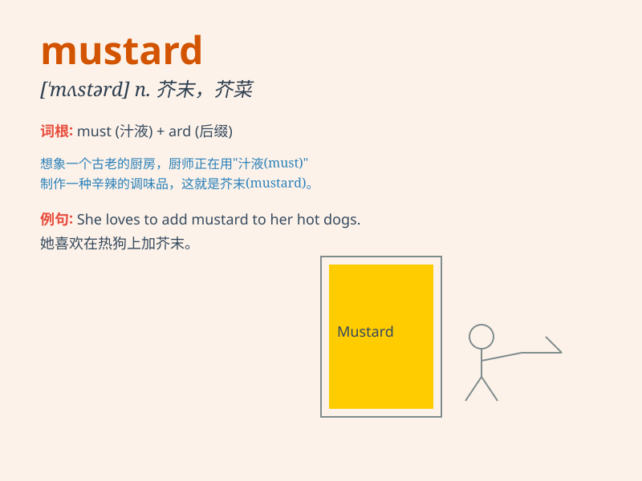

## mustard

**英音:** _[\'mʌstəd]_ **美音:** _[\'mʌstɚd]_

**译义:** *n.芥菜,芥末,芥末色,芥子气*

### 短语

+ **English mustard:** _英式芥末_

+ **mustard gas:** _芥子气_

+ **brown mustard:** _褐芥末_

+ **mustard seed:** _芥菜籽_

+ **hot mustard:** _辣芥末_

### 例句

#### 例句1

> **I don\'t like the taste of mustard on my sandwich.**

**中文翻译:** 我不喜欢三明治上芥末的味道。

**单词释义:** 芥末

#### 例句2

> **The hot dog is topped with mustard and ketchup.**

**中文翻译:** 热狗上面撒有芥末和番茄酱。

**单词释义:** 芥末

#### 例句3

> **She accidentally spilled the mustard all over the table.**

**中文翻译:** 她不小心把芥末洒满了桌子。

**单词释义:** 芥末

### 背诵小故事

> A king was very fond of having sandwiches with mustard. But one day,
all the mustard was gone. The chef had to rush to find more. So,
whenever the king thought of mustard, he remembered this incident.

**一位国王非常喜欢吃有芥末的三明治。但有一天，所有的芥末都用完了。厨师不得不赶紧去找更多。所以，每当国王想到芥末，就会想起这件事。**

### 图义

