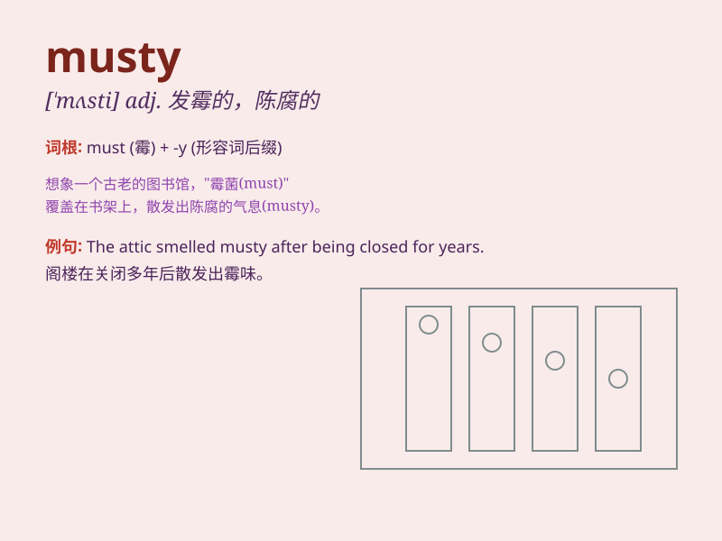

## musty

**英音:** _[\'mʌstɪ]_ **美音:** _[\'mʌsti]_

**译义:** *adj.发霉的,有霉味的,冷淡的*

### 短语

+ **musty smell:** _霉味_

+ **musty room:** _有霉味的房间_

+ **musty books:** _发霉的书_

+ **musty closet:** _有霉味的壁橱_

+ **musty basement:** _有霉味的地下室_

### 例句

#### 例句1

> **The old books in the attic had a musty smell.**

**中文翻译:** 阁楼上的旧书散发着霉味。

**单词释义:** 发霉的；有霉味的

#### 例句2

> **The room felt musty and damp after being closed for so long.**

**中文翻译:** 房间关了这么久，感觉有股霉味和潮湿。

**单词释义:** 有霉味的；潮湿的

#### 例句3

> **The musty air in the basement made it uncomfortable to stay there
for long.**

**中文翻译:** 地下室里霉味重重，长时间呆在里面很不舒服。

**单词释义:** 有霉味的

### 背诵小故事

> One day, Tom entered an old room. The air was musty. It smelled like
something had been stored there for a long time. He realized musty means
having a damp and unpleasant smell.

**有一天，汤姆走进一个旧房间。空气有股霉味。闻起来好像有东西在那里存放了很久。他明白了
musty 意思是有潮湿且难闻的气味。**

### 图义

