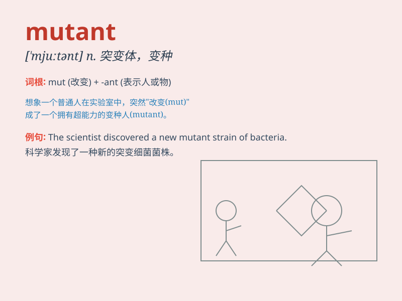

## mutant

**英音:** _[\'mjuːt(ə)nt]_ **美音:** _[\'mjutənt]_

**译义:** *n.突变异种*

### 短语

+ **mutant strain:** _突变株_

+ **mutant gene:** _突变基因_

+ **mutant form:** _突变形式_

+ **mutant protein:** _突变蛋白_

+ **mutant species:** _突变物种_

### 例句

#### 例句1

> **The mutant creature had strange powers.**

**中文翻译:** 这个变异生物拥有奇怪的力量。

**单词释义:** 变异的

#### 例句2

> **Scientists are studying the mutant genes.**

**中文翻译:** 科学家们正在研究突变基因。

**单词释义:** 变异的

#### 例句3

> **The mutant strain of the virus is more contagious.**

**中文翻译:** 该病毒的突变株传染性更强。

**单词释义:** 变异的

### 背诵小故事

> In a distant future, a strange virus spread. It turned many people
into mutants. These mutants had special powers and looked very
different. One mutant could fly, another had super strength. It was a
wild world.

**在遥远的未来，一种奇怪的病毒传播开来。它把许多人变成了变种人。这些变种人有特殊的能力，看起来非常不同。一个变种人能飞，另一个有超强的力量。这是一个疯狂的世界。**

### 图义

