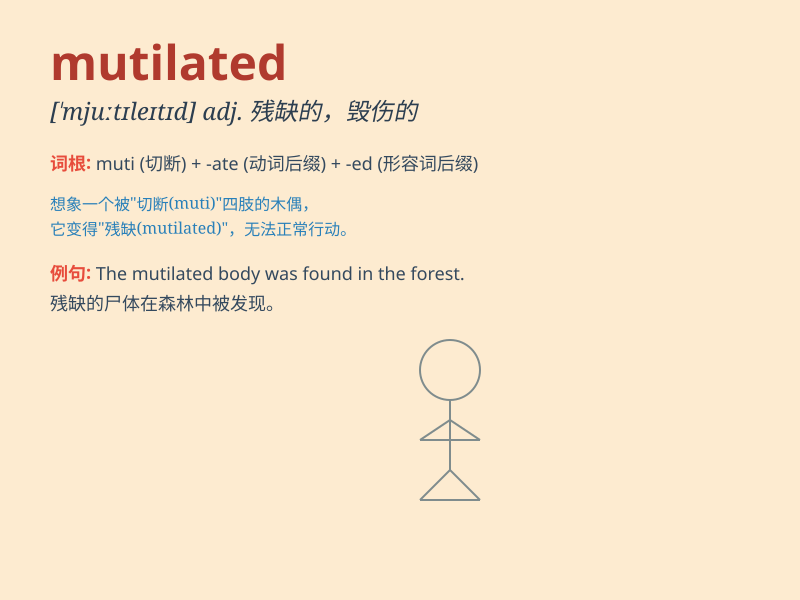

## mutilated

**英音:** _[ˈmjuːtɪleɪtɪd]_ **美音:** _[ˈmjuːtɪˌleɪtɪd]_

**译义:** *adj. 被肢解的；被毁伤的；残缺不全的*

### 短语

+ **mutilated body:** _残缺的身体_

+ **mutilated document:** _残缺的文件_

+ **mutilated limb:** _残缺的肢体_

+ **mutilated currency:** _残损的货币_

+ **mutilated statue:** _残缺的雕像_

### 例句

#### 例句1

> **The body was found mutilated beyond recognition.**

**中文翻译:** 尸体被发现时已残缺不全，无法辨认。

**单词释义:** 严重损伤；使残缺不全

#### 例句2

> **The thief mutilated the painting in an attempt to steal it.**

**中文翻译:** 小偷企图偷走这幅画，把它弄坏了。

**单词释义:** 破坏；毁坏

#### 例句3

> **He was mutilated in the accident and lost a leg.**

**中文翻译:** 他在事故中受伤致残，失去了一条腿。

**单词释义:** 使伤残

### 背诵小故事

> A brave adventurer was exploring a dark cave. Suddenly, a wild beast
attacked him, leaving his body mutilated. But he didn\'t give up and
managed to escape. Remember, \'mutilated\' means having body parts
severely damaged.

**一位勇敢的冒险家正在探索一个黑暗的洞穴。突然，一只野兽袭击了他，使他的身体残缺不全。但他没有放弃并设法逃脱了。记住，\'mutilated\'意思是身体部位严重受损。**

### 图义

