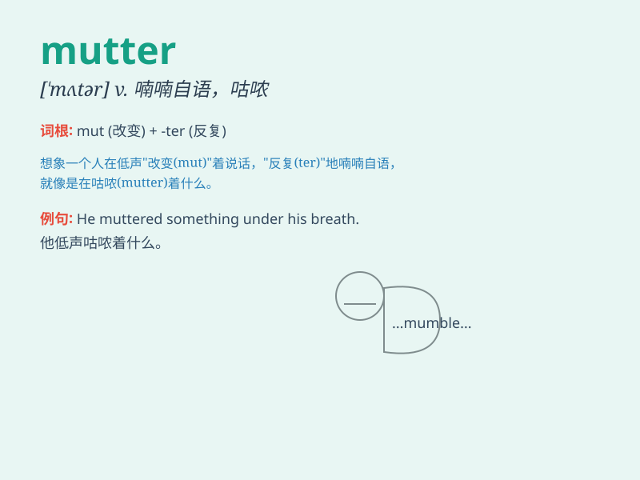

## mutter

**英音:** _[\'mʌtə]_ **美音:** _[\'mʌtɚ]_

**译义:** *n.咕哝,嘀咕v.咕哝,嘀咕*

### 短语

+ **mutter to oneself:** _自言自语_

+ **mutter under one\'s breath:** _低声嘟囔_

+ **mutter complaints:** _嘟囔着抱怨_

+ **mutter threats:** _低声威胁_

+ **mutter something inaudibly:** _含混不清地嘟囔着某事_

### 例句

#### 例句1

> **She muttered something under her breath.**

**中文翻译:** 她低声嘀咕了一句什么。

**单词释义:** 低声说，嘟囔

#### 例句2

> **He was muttering to himself as he walked along.**

**中文翻译:** 他一边走一边自言自语。

**单词释义:** 自言自语

#### 例句3

> **The old man muttered complaints about the bad weather.**

**中文翻译:** 老人咕哝着抱怨天气不好。

**单词释义:** 抱怨，发牢骚

### 背诵小故事

> 小明在课堂上小声 mutter
抱怨作业太多，被老师听到了。老师说：'小明，有意见就大声说出来，别
mutter。'小明不好意思地低下了头。

**小明在课堂上小声嘀咕抱怨作业太多，被老师听到了。老师说：'小明，有意见就大声说出来，别嘀咕。'小明不好意思地低下了头。**

### 图义

