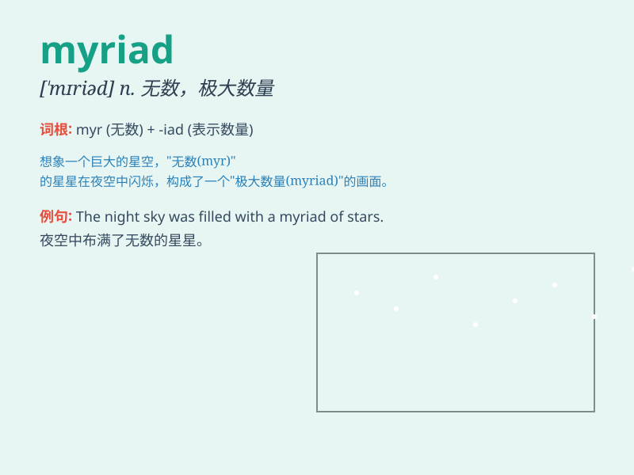

## myriad

**英音:** _[ˈmɪriəd]_ **美音:** _[ˈmɪriəd]_

**译义:** *n.无数,无数的人或物,\<诗>一万adj.无数的,一万的,种种的*

### 短语

+ **a myriad of:** _无数的；大量的_

+ **myriad stars:** _无数的星星_

+ **myriad problems:** _大量的问题_

+ **myriad thoughts:** _无数的想法_

+ **myriad possibilities:** _无数的可能性_

### 例句

#### 例句1

> **The sky was filled with a myriad of stars.**

**中文翻译:** 天空布满了无数的星星。

**单词释义:** 无数的

#### 例句2

> **She has faced a myriad of challenges in her career.**

**中文翻译:** 她在职业生涯中面临了无数的挑战。

**单词释义:** 无数的

#### 例句3

> **The museum showcases a myriad of artworks from different
periods.**

**中文翻译:** 博物馆展示了来自不同时期的大量艺术品。

**单词释义:** 大量的

### 背诵小故事

>
想象一下，你在一个神秘的花园里，看到无数（myriad）的蝴蝶在飞舞。它们的数量多到你根本数不清，就像天上的繁星一样。这个花园充满了色彩和生机，让你深刻记住myriad代表数量极多的意思。

**想象你在神秘花园看到数不清的蝴蝶，记住myriad表示数量极多**

### 图义

