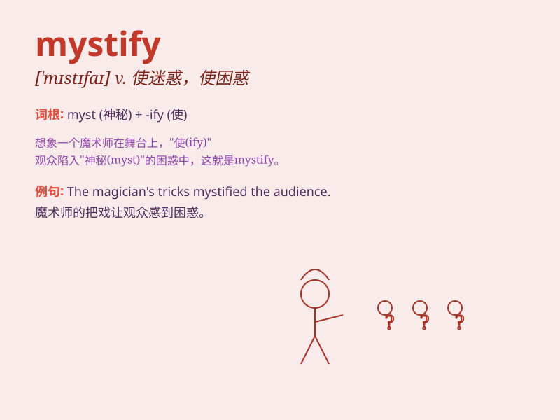

## mystify

**英音:** _[\'mɪstɪfaɪ]_ **美音:** _[\'mɪstə\'fai]_

**译义:** *v.迷惑*

### 短语

+ **mystify someone:** _使某人迷惑不解_

+ **be mystified by:** _被\...\...弄得迷惑_

+ **mystify the public:** _使公众感到迷惑_

+ **remain mystified:** _仍然感到迷惑_

+ **mystify completely:** _完全弄糊涂_

### 例句

#### 例句1

> **The strange behavior of the machine mystified the engineer.**

**中文翻译:** 机器的奇怪行为让工程师感到迷惑。

**单词释义:** 使迷惑

#### 例句2

> **The plot of the movie mystified most of the audience.**

**中文翻译:** 这部电影的情节让大多数观众感到迷惑不解。

**单词释义:** 使困惑

#### 例句3

> **Her sudden disappearance mystified everyone.**

**中文翻译:** 她的突然消失让每个人都感到迷惑。

**单词释义:** 使神秘化

### 背诵小故事

> A detective was trying to solve a mysterious case that seemed to
mystify everyone. The clues were all over the place, but they made no
sense. Just like this word, it confuses and puzzles.

**一位侦探试图侦破一个似乎让所有人都迷惑不解的神秘案件。线索到处都是，但毫无头绪。就像\'mystify\'这个单词，它使人困惑和迷惑。**

### 图义

