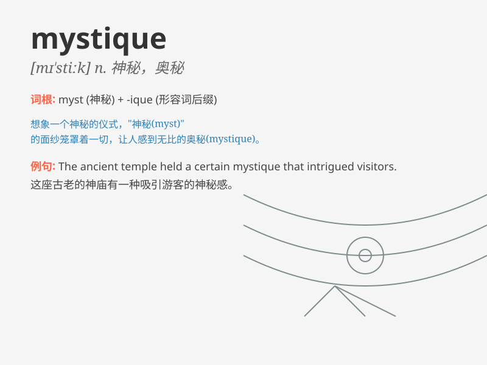

## mystique

**英音:** _[mɪ\'stiːk]_ **美音:** _[mɪ\'stik]_

**译义:** *n.神秘性,奥秘,秘法*

### 短语

+ **mystique charm:** _神秘魅力_

+ **mystique atmosphere:** _神秘氛围_

+ **maintain mystique:** _保持神秘_

+ **unravel the mystique:** _揭开神秘面纱_

+ **the mystique of nature:** _大自然的神秘性_

### 例句

#### 例句1

> **The old castle has a certain mystique that attracts many
tourists.**

**中文翻译:** 这座古老的城堡有一种独特的神秘魅力，吸引了许多游客。

**单词释义:** 神秘的魅力；神秘性

#### 例句2

> **The actress added to the mystique of the character by her
enigmatic performance.**

**中文翻译:**
这位女演员通过她神秘莫测的表演为这个角色增添了神秘色彩。

**单词释义:** 神秘；神秘色彩

#### 例句3

> **The mystique surrounding the ancient ritual has puzzled scholars
for years.**

**中文翻译:** 围绕着这个古老仪式的神秘性多年来一直困扰着学者们。

**单词释义:** 神秘；神秘的氛围

### 背诵小故事

> A young adventurer entered an ancient temple full of mystery. The
temple had a certain mystique that made him curious. Every corner seemed
to hold a secret. He was determined to uncover the hidden truths within
this enigmatic place.

**一位年轻的冒险家进入了一座充满神秘色彩的古老寺庙。这座寺庙有一种神秘的魅力，让他十分好奇。每个角落似乎都藏着秘密。他决心揭开这个神秘地方隐藏的真相。**

### 图义

