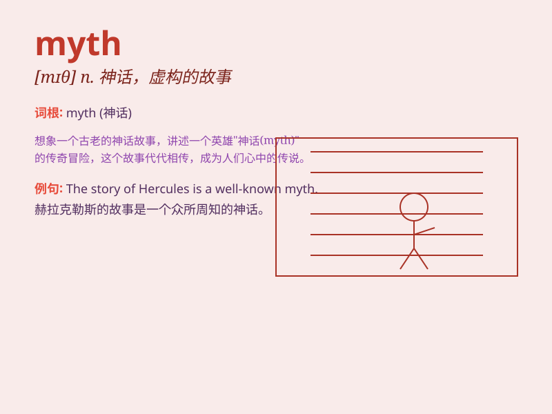

## myth

**英音:** _[mɪθ]_ **美音:** _[mɪθ]_

**译义:** *n.神话,神话式的人物(或事物),虚构的故事,荒诞的说法*

### 短语

+ **urban myth:** _都市神话_

+ **ancient myth:** _古代神话_

+ **creation myth:** _创世神话_

+ **popular myth:** _流行的神话_

+ **myth and legend:** _神话和传说_

### 例句

#### 例句1

> **The story of King Arthur and the Knights of the Round Table is a
myth.**

**中文翻译:** 亚瑟王和圆桌骑士的故事是一个神话。

**单词释义:** 神话；传说

#### 例句2

> **There is a myth that eating carrots improves your eyesight.**

**中文翻译:** 有一种说法是吃胡萝卜能提高视力。

**单词释义:** 错误的看法；无根据的观念

#### 例句3

> **The myth of the perfect relationship often leads to
disappointment.**

**中文翻译:** 完美关系的神话常常导致失望。

**单词释义:** 虚构的事物；幻想

### 背诵小故事

> Once upon a time, there was a village where people believed in a
strange creature. But no one had ever seen it. This unproven tale was
like a myth. Eventually, they realized it was just their imagination.

**从前，有个村子，人们相信一种奇怪生物的存在。但没人见过。这个未经证实的传说就像一个神话。最终，他们意识到这只是他们的想象。**

### 图义

