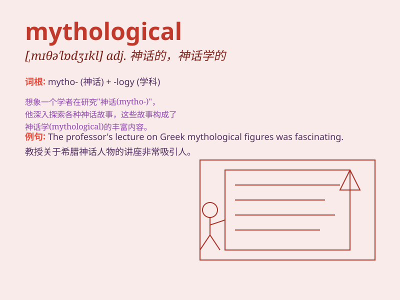

## mythological

**英音:** _[mɪθə\'lɒdʒɪk(ə)l]_ **美音:**
_[,mɪθə\'lɑdʒɪkl]_

**译义:** *adj.神话学的,神话的,虚构的*

### 短语

+ **mythological creature:** _神话生物_

+ **mythological story:** _神话故事_

+ **mythological figure:** _神话人物_

+ **mythological world:** _神话世界_

+ **mythological belief:** _神话信仰_

### 例句

#### 例句1

> **The movie is based on a mythological story.**

**中文翻译:** 这部电影基于一个神话故事。

**单词释义:** 神话的

#### 例句2

> **He was interested in mythological creatures like unicorns and
dragons.**

**中文翻译:** 他对像独角兽和龙这样的神话生物感兴趣。

**单词释义:** 神话中的

#### 例句3

> **The temple was decorated with mythological symbols.**

**中文翻译:** 这座寺庙用神话符号装饰。

**单词释义:** 神话学的

### 背诵小故事

> Long ago, in a faraway land, there was a mysterious book filled with
mythological creatures. A brave adventurer set out to explore these
tales. The creatures were so fantastical, like dragons and unicorns.
Remember, mythological means related to myths and legends.

**很久以前，在一个遥远的地方，有一本充满神话生物的神秘书籍。一位勇敢的冒险家出发去探索这些故事。这些生物非常奇幻，比如龙和独角兽。记住，mythological
意思是与神话和传说有关的。**

### 图义

