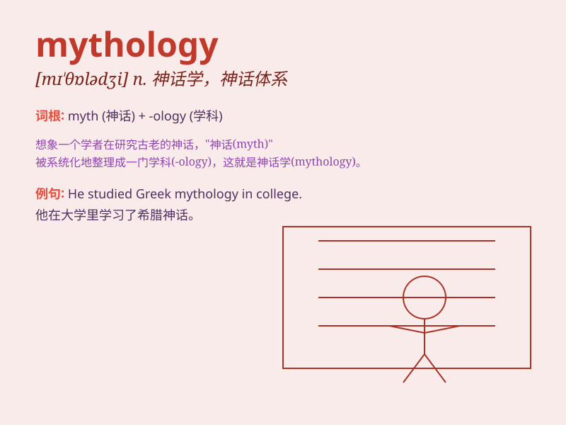

## mythology

**英音:** _[mɪ\'θɒlədʒɪ]_ **美音:** _[mɪ\'θɑlədʒi]_

**译义:** *n.神话*

### 短语

+ **Greek mythology:** _希腊神话_

+ **Roman mythology:** _罗马神话_

+ **Norse mythology:** _北欧神话_

+ **mythology studies:** _神话学研究_

+ **ancient mythology:** _古代神话_

### 例句

#### 例句1

> **The study of Greek mythology is fascinating.**

**中文翻译:** 对希腊神话的研究很迷人。

**单词释义:** 神话学；神话

#### 例句2

> **His paintings are inspired by Celtic mythology.**

**中文翻译:** 他的画作受到凯尔特神话的启发。

**单词释义:** 神话；神话体系

#### 例句3

> **She has a deep knowledge of Norse mythology.**

**中文翻译:** 她对北欧神话有很深的了解。

**单词释义:** 神话；神话故事

### 背诵小故事

> Long ago, a curious boy named Tom loved reading about heroes and
monsters. These tales formed a collection called \'mythology\'. It was
like a magical world full of wonders and mysteries that Tom couldn\'t
get enough of.

**很久以前，一个叫汤姆的好奇男孩喜欢读有关英雄和怪物的故事。这些故事形成的集合就叫'神话学'。它就像一个充满奇迹和神秘的神奇世界，让汤姆欲罢不能。**

### 图义

