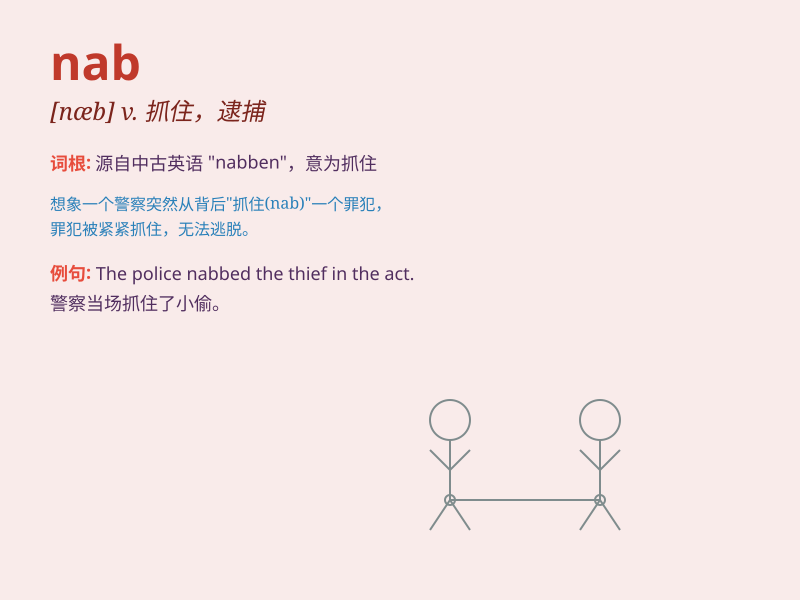

## nab

**英音:** _[næb]_ **美音:** _[næb]_

**译义:** *vt.\<口>捉住,逮捕,抢夺*

### 短语

+ **nab someone:** _抓住某人_

+ **nab a thief:** _捉住一个小偷_

+ **nab the opportunity:** _抓住机会_

+ **nab a criminal:** _抓获一名罪犯_

+ **nab the culprit:** _抓住罪犯_

### 例句

#### 例句1

> **The police managed to nab the thief as he was trying to
escape.**

**中文翻译:** 警察在小偷试图逃跑时设法抓住了他。

**单词释义:** 抓住，逮捕

#### 例句2

> **She nabbed the last piece of cake before anyone else could get
it.**

**中文翻译:** 她在别人拿到之前抢走了最后一块蛋糕。

**单词释义:** 抢夺，夺得

#### 例句3

> **I managed to nab a seat at the front of the bus.**

**中文翻译:** 我设法在公交车前部抢到了一个座位。

**单词释义:** 抢到，夺得

### 背诵小故事

> A thief was trying to steal a bag in the market. Just as he was about
to run away, a brave police officer nabbed him. The thief had no chance
to escape.

**一个小偷在市场上正试图偷一个包。就在他要逃跑时，一位勇敢的警察抓住了他。小偷没有机会逃脱。**

### 图义

