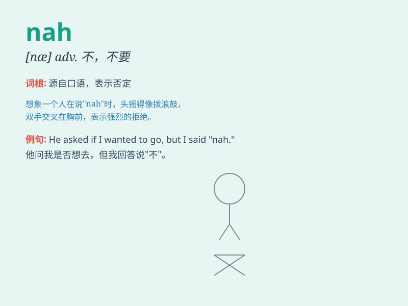

## nah

**英音:** _[nɑː]_ **美音:** _[næ]_

**译义:** *int.不，不是（用于表示否定或拒绝）*

### 短语

+ **Nah, I don\'t think so.:** _不，我不这么认为。_

+ **Nah, it\'s not possible.:** _不，这不可能。_

+ **Nah, I\'m not interested.:** _不，我没兴趣。_

+ **Nah, that won\'t work.:** _不，那行不通。_

+ **Nah, I\'ve had enough.:** _不，我已经够了。_

### 例句

#### 例句1

> **Nah, I don\'t think so.**

**中文翻译:** 不，我不这么认为。

**单词释义:** 不，否

#### 例句2

> **Nah, it\'s not worth it.**

**中文翻译:** 不，这不值得。

**单词释义:** 不，否定

#### 例句3

> **Nah, I\'m not interested.**

**中文翻译:** 不，我没兴趣。

**单词释义:** 不，拒绝

### 背诵小故事

> One day, Tom and Jerry were arguing. Tom said yes, but Jerry firmly
replied \'nah\'. It means no, showing Jerry\'s strong opposition. So
when you want to say no firmly, you can use \'nah\'.

**有一天，汤姆和杰瑞在争论。汤姆说是的，但杰瑞坚决地回答"nah"。它的意思是不，表示杰瑞的强烈反对。所以当你想坚决地说不的时候，你可以用"nah"。**

### 图义

