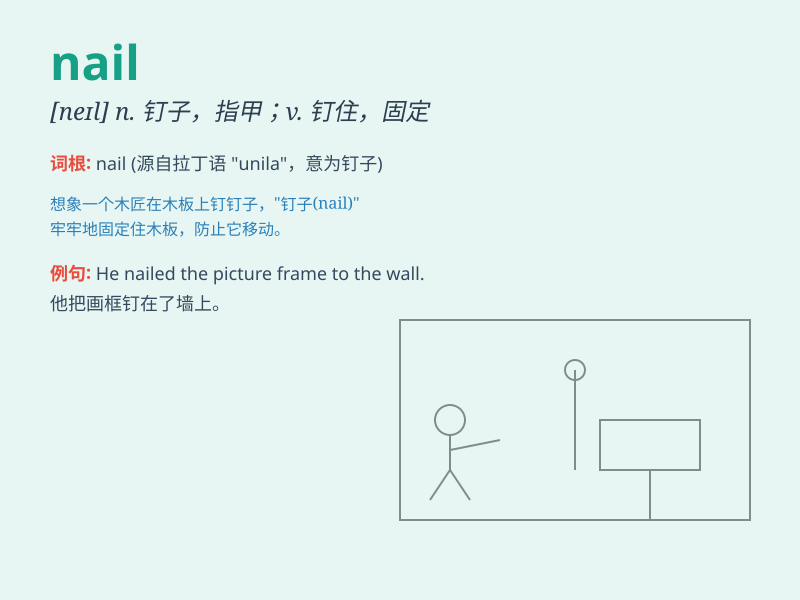

## nail

**英音:** _[neɪl]_ **美音:** _[nel]_

**译义:** *n.指甲,钉,钉子vt.钉,将\...钉牢*

### 短语

+ **nail down:** _确定；明确_

+ **hit the nail on the head:** _说得中肯；一针见血_

+ **nail polish:** _指甲油_

+ **nail file:** _指甲锉_

+ **nail clipper:** _指甲钳_

### 例句

#### 例句1

> **She hammered the nail into the wall.**

**中文翻译:** 她把钉子钉进墙上。

**单词释义:** 钉子

#### 例句2

> **I finally nailed the problem.**

**中文翻译:** 我终于解决了这个问题。

**单词释义:** 抓住；解决

#### 例句3

> **He was nailed for stealing.**

**中文翻译:** 他因偷窃而被钉死。

**单词释义:** 抓住；逮住

### 背诵小故事

> A thief was trying to break into a house. But the owner heard the
noise and used a nail to fix the window and stop the thief. The nail was
the hero!

**一个小偷试图闯入一所房子。但主人听到了声音，用一颗钉子固定住窗户阻止了小偷。钉子成了英雄！**

### 图义

