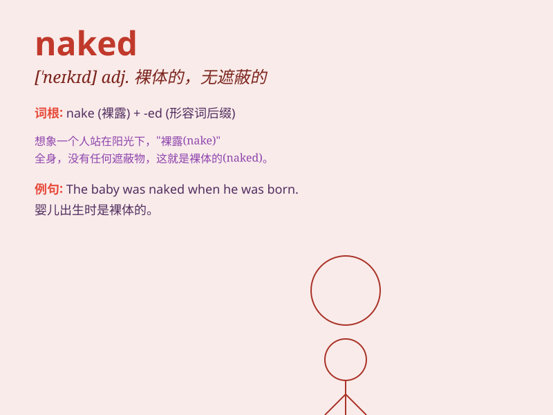

## naked

**英音:** _[\'neɪkɪd]_ **美音:** _[\'nekɪd]_

**译义:**
*adj.裸体的,无遮盖的,无装饰的,无保护的,[律]无证据的,未证实的*

### 短语

+ **naked eye:** _肉眼_

+ **naked flame:** _明火_

+ **naked truth:** _赤裸裸的事实_

+ **naked aggression:** _公然侵略_

+ **naked sword:** _出鞘的剑_

### 例句

#### 例句1

> **The baby was born naked.**

**中文翻译:** 婴儿出生时是赤身裸体的。

**单词释义:** 裸露的；裸体的

#### 例句2

> **She was walking around the house naked.**

**中文翻译:** 她赤身裸体在房子里走来走去。

**单词释义:** 裸体的；光着身子的

#### 例句3

> **The truth was laid naked before us.**

**中文翻译:** 真相赤裸裸地展现在我们面前。

**单词释义:** 无遮蔽的；暴露的

### 背诵小故事

> A thief broke into a house at night. But the lights suddenly turned
on and he was naked in the middle of the room, with no place to hide. It
means being without any cover or protection, just like the exposed
thief.

**一个小偷在晚上闯入一所房子。但灯突然亮了，他赤裸裸地站在房间中间，无处可藏。这意味着没有任何遮盖或保护，就像暴露的小偷那样。**

### 图义

