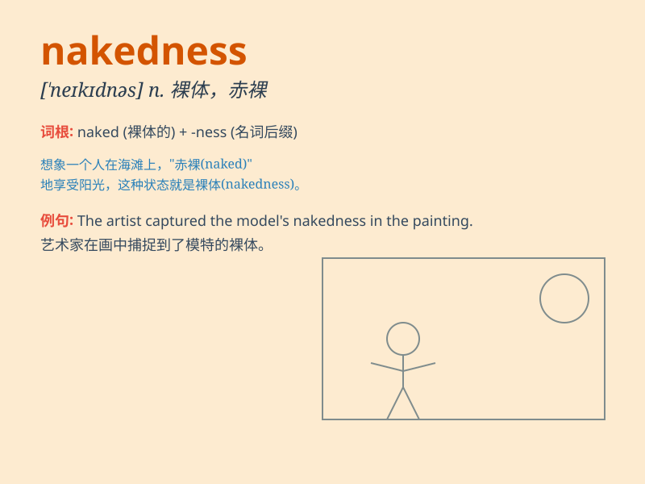

## nakedness

**英音:** _[\'neɪkɪdnəs]_ **美音:** _[\'neɪkɪdnəs]_

**译义:** *n.裸出*

### 短语

+ **expose nakedness:** _暴露裸体_

+ **indecent nakedness:** _不雅的裸体_

+ **total nakedness:** _完全赤裸_

+ **nakedness of soul:** _灵魂的赤裸_

+ **unashamed nakedness:** _不知羞耻的裸体_

### 例句

#### 例句1

> **The nakedness of the landscape was both beautiful and
intimidating.**

**中文翻译:** 裸露的风景既美丽又令人生畏。

**单词释义:** 空旷；光秃

#### 例句2

> **She was ashamed of her nakedness in front of strangers.**

**中文翻译:** 她对在陌生人面前赤身露体感到羞耻。

**单词释义:** 赤裸；裸体

#### 例句3

> **The poet described the nakedness of human emotions in his
work.**

**中文翻译:** 诗人在他的作品中描述了人类情感的赤裸裸。

**单词释义:** 毫无掩饰；坦率

### 背诵小故事

> Once upon a time, a traveler got lost in a forest. When night fell,
he felt a chill and realized his nakedness as he had no warm clothes. It
was a scary moment, highlighting his vulnerable state.

**从前，有个旅行者在森林里迷路了。夜幕降临时，他感到一阵寒意，意识到自己的赤裸状态，因为他没有暖和的衣服。这是一个可怕的时刻，凸显了他的脆弱。**

### 图义

