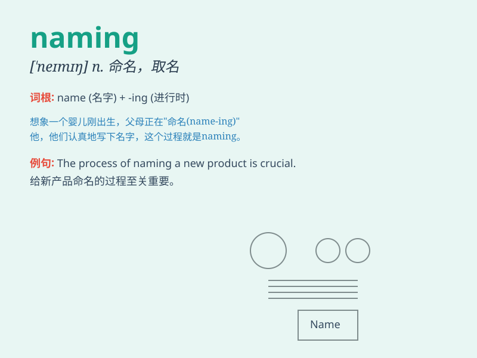

## naming

**英音:** _[ˈneɪmɪŋ]_ **美音:** _[ˈneɪmɪŋ]_

**译义:** *n.命名*

### 短语

+ **naming ceremony:** _命名仪式_

+ **naming rights:** _冠名权_

+ **naming convention:** _命名约定；命名惯例_

+ **product naming:** _产品命名_

+ **brand naming:** _品牌命名_

### 例句

#### 例句1

> **The naming of the new product was a challenging task.**

**中文翻译:** 新产品的命名是一项具有挑战性的任务。

**单词释义:** 命名

#### 例句2

> **Naming conventions vary from company to company.**

**中文翻译:** 不同公司的命名约定各不相同。

**单词释义:** 命名；称呼

#### 例句3

> **The naming ceremony was a grand event.**

**中文翻译:** 命名仪式是一场盛大的活动。

**单词释义:** 命名

### 背诵小故事

> A little girl was playing a naming game. She had to name all the toys
in her room. It was fun and challenging. Through this game, she learned
how important naming is.

**一个小女孩正在玩命名游戏。她必须给房间里所有的玩具命名。这既有趣又有挑战性。通过这个游戏，她明白了命名的重要性。**

### 图义

