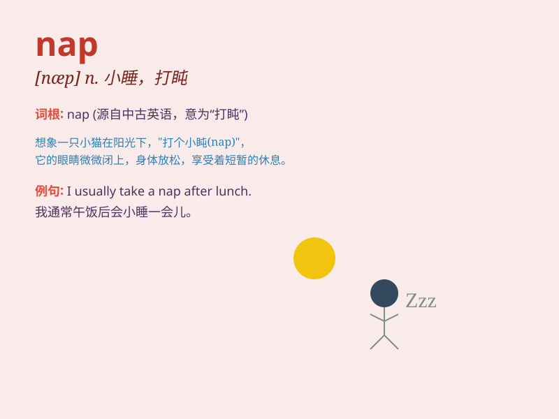

## nap

**英音:** _[næp]_ **美音:** _[næp]_

**译义:**
*n.(白天)小睡,打盹,细毛,孤注一掷;vi.小睡,疏忽;vt.使拉毛,修整,预测\...为获胜马;Nationa
Attachment Point,国家附属站点*

### 短语

+ **take a nap:** _睡午觉；小睡一下_

+ **cat nap:** _打瞌睡；小睡_

+ **power nap:** _有效的午睡；恢复精力的小睡_

+ **nap time:** _午睡时间；小睡时间_

+ **nap fabric:** _起绒织物；毛圈织物_

### 例句

#### 例句1

> **I often take a nap after lunch.**

**中文翻译:** 我经常在午饭后小睡一会儿。

**单词释义:** 小睡；打盹

#### 例句2

> **The cat is having a nap in the sun.**

**中文翻译:** 猫正在阳光下打盹。

**单词释义:** 小睡；打盹

#### 例句3

> **She sneaked in for a quick nap when no one was looking.**

**中文翻译:** 她趁没人注意的时候偷偷溜进去小睡了一会儿。

**单词释义:** 小睡；打盹

### 背诵小故事

> One day, a tired little mouse decided to take a nap. It found a cozy
corner and curled up. Soon, it was fast asleep, dreaming sweet dreams.
When it woke up, it felt refreshed and ready for new adventures.

**有一天，一只疲倦的小老鼠决定小睡一会儿。它找了个舒适的角落蜷缩起来。很快，它就熟睡过去，做着甜甜的梦。当它醒来时，感觉精神焕发，准备好迎接新的冒险了。**

### 图义

