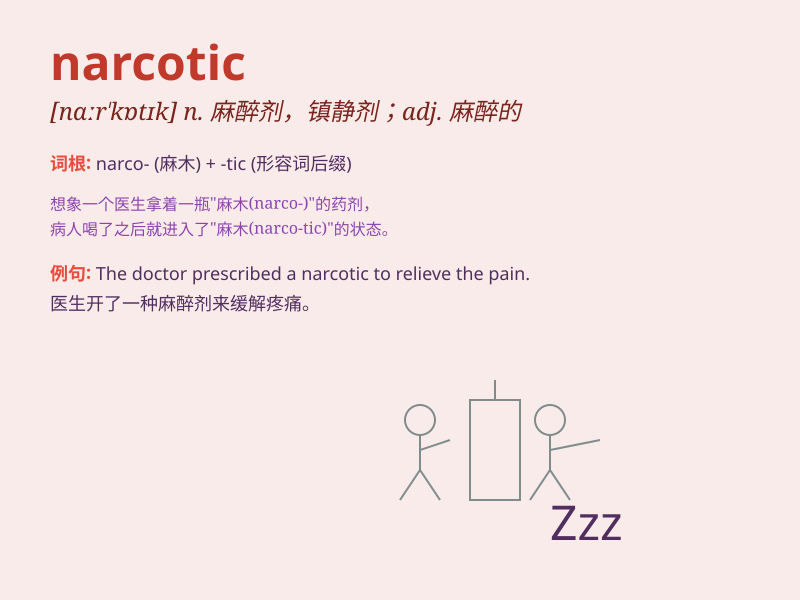

## narcotic

**英音:** _[nɑː\'kɒtɪk]_ **美音:** _[nɑr\'kɑtɪk]_

**译义:** *n.麻醉药,致幻毒品,镇静剂adj.麻醉的,催眠的*

### 短语

+ **narcotic addiction:** _麻醉品成瘾_

+ **narcotic drugs:** _麻醉药品_

+ **narcotic effect:** _麻醉效果_

+ **narcotic substance:** _麻醉物质_

+ **narcotic stupor:** _麻醉性昏迷_

### 例句

#### 例句1

> **The police found a large quantity of narcotic drugs in his
car.**

**中文翻译:** 警方在他的车里发现了大量的麻醉药品。

**单词释义:** 麻醉的；麻醉剂

#### 例句2

> **She was addicted to narcotic substances and needed professional
help to recover.**

**中文翻译:** 她对麻醉物质上瘾，需要专业帮助来恢复。

**单词释义:** 麻醉性的；致瘾的

#### 例句3

> **The doctor prescribed a mild narcotic to help him sleep.**

**中文翻译:** 医生开了一种温和的麻醉剂来帮助他入睡。

**单词释义:** 麻醉药

### 背诵小故事

> A detective was on the trail of a criminal who dealt in narcotic
drugs. The detective found a hidden room filled with strange powders and
knew they were the narcotic substances. Finally, the criminal was
caught.

**一位侦探在追踪一个贩卖麻醉药品的罪犯。侦探发现了一个隐藏的房间，里面装满了奇怪的粉末，知道它们是麻醉物质。最终，罪犯被抓获。**

### 图义

