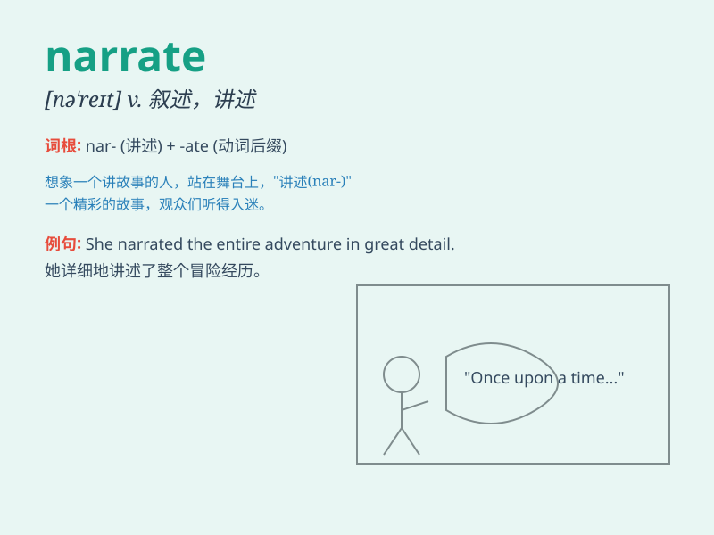

## narrate

**英音:** _[nə\'reɪt]_ **美音:** _[næret]_

**译义:** *v.叙述,讲述,作解说,讲故事*

### 短语

+ **narrate a story:** _讲述一个故事_

+ **narrate an incident:** _叙述一个事件_

+ **narrate one\'s experience:** _讲述某人的经历_

+ **narrate in detail:** _详细叙述_

+ **narrate vividly:** _生动地叙述_

### 例句

#### 例句1

> **The old man narrated his adventures during the war.**

**中文翻译:** 这位老人叙述了他在战争期间的冒险经历。

**单词释义:** 叙述

#### 例句2

> **She was asked to narrate the story to the children.**

**中文翻译:** 她被要求给孩子们讲述这个故事。

**单词释义:** 讲述

#### 例句3

> **The documentary film narrates the history of the city.**

**中文翻译:** 这部纪录片叙述了这座城市的历史。

**单词释义:** 叙述

### 背诵小故事

> A little girl loved to narrate her dreams to her teddy bear. Every
night, she would describe the wonderful adventures she had in her sleep.
One day, her parents heard her and were amazed by her vivid narrations.

**一个小女孩喜欢向她的泰迪熊叙述她的梦。每天晚上，她都会描述她在睡梦中的奇妙冒险。有一天，她的父母听到了，对她生动的叙述感到惊讶。**

### 图义

