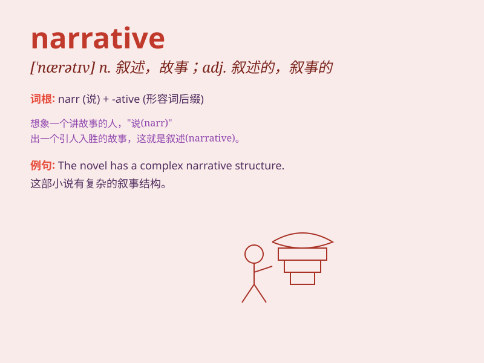

## narrative

**英音:** _[\'nærətɪv]_ **美音:** _[\'nærətɪv]_

**译义:** *adj.叙述性的n.叙述*

### 短语

+ **narrative poem:** _叙事诗_

+ **narrative style:** _叙事风格_

+ **narrative thread:** _叙事线索_

+ **personal narrative:** _个人叙述_

+ **historical narrative:** _历史叙述_

### 例句

#### 例句1

> **The book presents a fascinating narrative of her adventures.**

**中文翻译:** 这本书呈现了她冒险经历的迷人叙述。

**单词释义:** 叙述；故事

#### 例句2

> **His narrative skills made the history lesson very engaging.**

**中文翻译:** 他的叙述技巧使历史课非常引人入胜。

**单词释义:** 叙述；讲述

#### 例句3

> **The film has a complex narrative structure.**

**中文翻译:** 这部电影有一个复杂的叙事结构。

**单词释义:** 叙事；叙述方式

### 背诵小故事

> A young writer struggled to find the perfect narrative for his story.
One night, he had a dream where a magical fairy showed him a wonderful
sequence of events. When he woke up, he knew exactly how to create his
narrative.

**一位年轻的作家努力为他的故事寻找完美的叙述。一天晚上，他做了一个梦，一个神奇的仙女向他展示了一系列精彩的事件。当他醒来时，他确切地知道如何创作他的叙述了。**

### 图义

