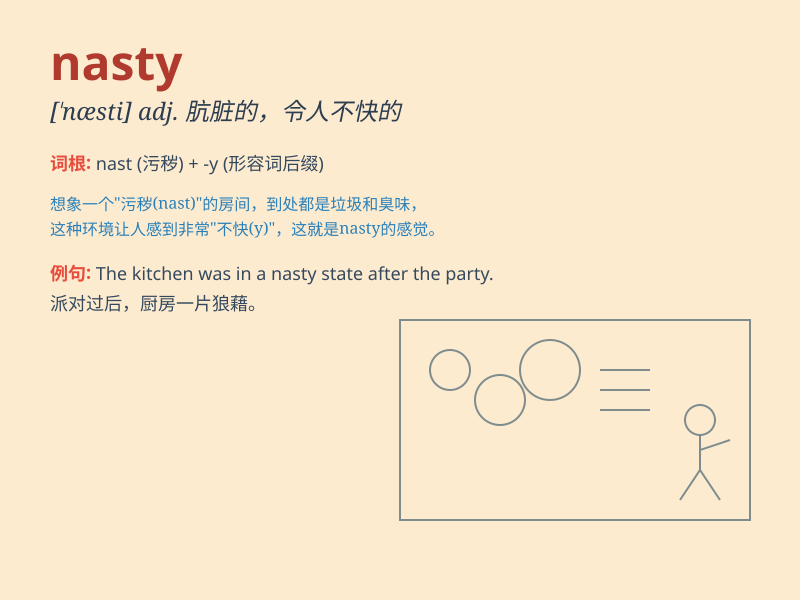

## nasty

**英音:** _[\'nɑːstɪ]_ **美音:** _[\'næsti]_

**译义:**
*adj.污秽的,肮脏的,令人厌恶的,淫秽的,下流的,凶相的,威胁的*

### 短语

+ **nasty habit:** _不良习惯_

+ **nasty surprise:** _令人不快的意外_

+ **nasty weather:** _恶劣天气_

+ **nasty temper:** _坏脾气_

+ **nasty wound:** _严重的伤口_

### 例句

#### 例句1

> **The weather is really nasty today.**

**中文翻译:** 今天的天气真的很恶劣。

**单词释义:** 恶劣的

#### 例句2

> **He had a nasty fall and hurt his leg.**

**中文翻译:** 他狠狠地摔了一跤，伤到了腿。

**单词释义:** 严重的

#### 例句3

> **She received a nasty comment on her social media post.**

**中文翻译:** 她在社交媒体帖子上收到了一条令人讨厌的评论。

**单词释义:** 令人讨厌的

### 背诵小故事

> A little boy was playing in the garden when he saw a nasty snake. The
snake was ugly and had a fierce look. It scared the boy a lot. From then
on, he remembered the word \'nasty\' for such bad and unpleasant things.

**一个小男孩正在花园里玩耍，这时他看到了一条讨厌的蛇。这条蛇长得很丑，样子很凶。这把小男孩吓得够呛。从那以后，他记住了\'nasty\'这个词，用来形容不好的、令人不快的事物。**

### 图义

