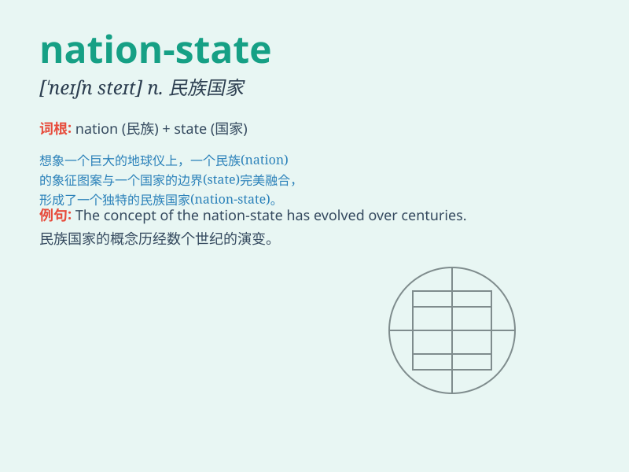

## nation-state

**英音:** _[ˈneɪʃən steɪt]_ **美音:** _[ˈneɪʃən steɪt]_

**译义:** *n. 民族国家；国家*

### 短语

+ **sovereign nation-state:** _主权民族国家_

+ **emerging nation-state:** _新兴民族国家_

+ **stable nation-state:** _稳定的民族国家_

+ **multicultural nation-state:** _多元文化的民族国家_

+ **developed nation-state:** _发达的民族国家_

### 例句

#### 例句1

> **The rise of the nation-state was a significant event in modern
history.**

**中文翻译:** 民族国家的兴起是现代历史上的一个重要事件。

**单词释义:** 民族国家

#### 例句2

> **The concept of the nation-state has evolved over time.**

**中文翻译:** 民族国家的概念随着时间的推移而演变。

**单词释义:** 民族国家

#### 例句3

> **The nation-state plays a crucial role in international
relations.**

**中文翻译:** 民族国家在国际关系中起着关键作用。

**单词释义:** 民族国家

### 背诵小故事

> Imagine a big land where people of the same nation live together and
have their own government and rules. This land is a \'nation-state\', a
place where the nation and the state are closely combined.

**想象有一片广阔的土地，相同民族的人们生活在一起，并有自己的政府和规则。这片土地就是"民族国家"，一个民族和国家紧密结合的地方。**

### 图义

