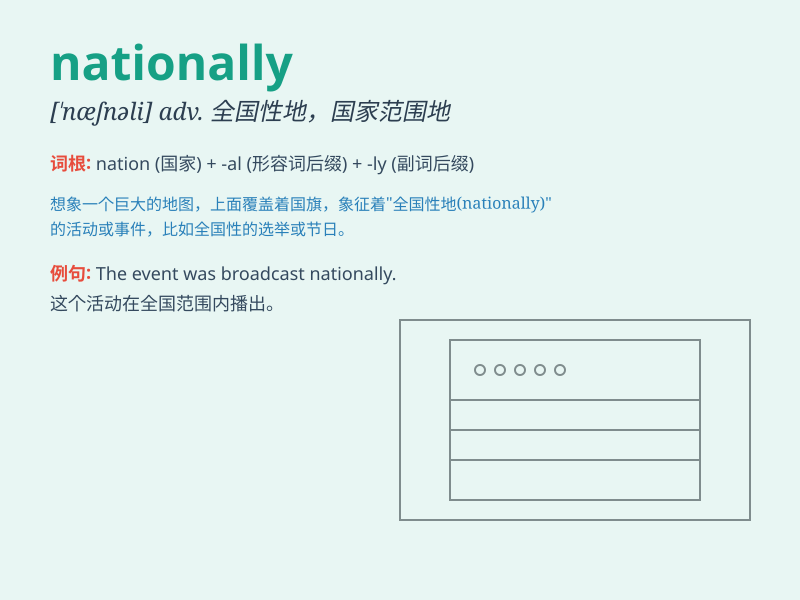

## nationally

**英音:** _[ˈnæʃnəli]_ **美音:** _[ˈnæʃnəli]_

**译义:** *adv.全国性,举国一致*

### 短语

+ **nationally recognized:** _全国公认的_

+ **nationally important:** _全国重要的_

+ **nationally renowned:** _全国知名的_

+ **nationally representative:** _全国代表性的_

+ **nationally available:** _全国可获得的_

### 例句

#### 例句1

> **The athlete is nationally recognized for his outstanding
performance.**

**中文翻译:** 这位运动员因其出色的表现而在全国范围内得到认可。

**单词释义:** 在全国范围内

#### 例句2

> **This issue is being discussed nationally.**

**中文翻译:** 这个问题正在全国范围内被讨论。

**单词释义:** 在全国范围内

#### 例句3

> **The product is nationally available in all major stores.**

**中文翻译:** 该产品在全国所有主要商店都有销售。

**单词释义:** 在全国范围内

### 背诵小故事

> A young athlete aimed to become famous nationally. He trained hard,
won many local competitions, and finally his talent was recognized
across the nation. His story inspired others to pursue their dreams.

**一位年轻的运动员立志在全国出名。他刻苦训练，赢得了许多本地比赛，最终他的才华得到了全国的认可。他的故事激励了其他人去追求梦想。**

### 图义

