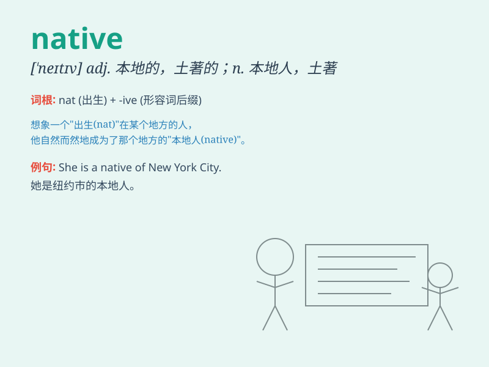

## native

**英音:** _[\'neɪtɪv]_ **美音:** _[\'netɪv]_

**译义:**
*n.本地人,土产,土人adj.本国的,出生地的,本地的,与生俱来的,天赋的,土产的,土著的*

### 短语

+ **native language:** _母语_

+ **native speaker:** _说本族语的人；母语使用者_

+ **native land:** _祖国；故乡_

+ **native place:** _籍贯；出生地_

+ **native ability:** _天生的能力_

### 例句

#### 例句1

> **He is a native of New York.**

**中文翻译:** 他是纽约本地人。

**单词释义:** 本地人；当地人

#### 例句2

> **The koala is a native Australian animal.**

**中文翻译:** 考拉是澳大利亚本土的动物。

**单词释义:** 本土的；原产于某地的

#### 例句3

> **She has a native ability to play the piano.**

**中文翻译:** 她有弹钢琴的天赋。

**单词释义:** 天生的；与生俱来的

### 背诵小故事

> A young traveler was lost in a strange land. A kind native appeared
and guided him home. The native knew every path and secret of the area.
The traveler was grateful for the native\'s help.

**一位年轻的旅行者在陌生的地方迷路了。一位善良的本地人出现并引导他回家。本地人熟悉这个地区的每条道路和秘密。旅行者非常感激本地人的帮助。**

### 图义

