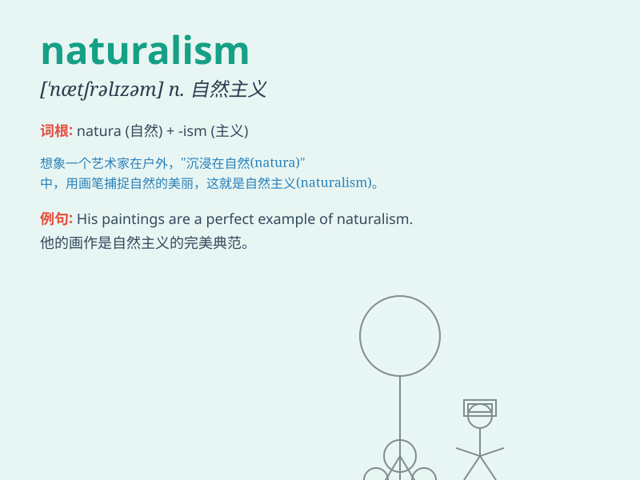

## naturalism

**英音:** _[\'nætʃ(ə)rəlɪz(ə)m]_ **美音:**
_[\'nætʃrəlɪzəm]_

**译义:** *n.自然主义,本能行动*

### 短语

+ **literary naturalism:** _文学自然主义_

+ **philosophical naturalism:** _哲学自然主义_

+ **artistic naturalism:** _艺术自然主义_

+ **critical naturalism:** _批判自然主义_

+ **evolutionary naturalism:** _进化自然主义_

### 例句

#### 例句1

> **Naturalism emphasizes the role of nature in shaping human
experience.**

**中文翻译:** 自然主义强调自然在塑造人类经验方面的作用。

**单词释义:** 自然主义

#### 例句2

> **The novel is written in a style of naturalism.**

**中文翻译:** 这部小说是以自然主义的风格写的。

**单词释义:** 自然主义

#### 例句3

> **Naturalism was a major literary movement in the 19th century.**

**中文翻译:** 自然主义是 19 世纪的一个主要文学运动。

**单词释义:** 自然主义

### 背诵小故事

> Once upon a time, a painter loved to depict nature exactly as it was.
His style was called naturalism. He showed the real beauty and truth of
the natural world.

**从前，有一位画家喜欢完全按照自然本来的样子描绘它。他的这种风格被称为自然主义。他展现了自然界真实的美和真相。**

### 图义

