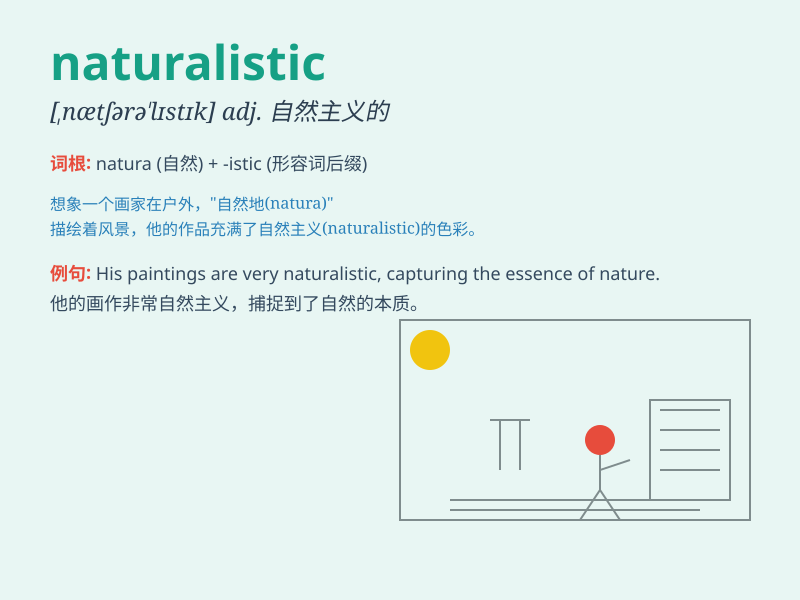

## naturalistic

**英音:** _[nætʃ(ə)rə\'lɪstɪk]_ **美音:**
_[,nætʃrə\'lɪstɪk]_

**译义:** *adj.自然的,自然主义的,博物学的*

### 短语

+ **naturalistic observation:** _自然观察_

+ **naturalistic painting:** _自然主义绘画_

+ **naturalistic approach:** _自然主义方法_

+ **naturalistic study:** _自然主义研究_

+ **naturalistic style:** _自然主义风格_

### 例句

#### 例句1

> **The artist\'s paintings have a naturalistic style, depicting
nature with great precision.**

**中文翻译:**
这位艺术家的画作有一种自然主义的风格，极其精确地描绘了大自然。

**单词释义:** 自然主义的

#### 例句2

> **The play presented a naturalistic view of family life.**

**中文翻译:** 这部戏剧呈现了家庭生活的自然主义视角。

**单词释义:** 自然主义的

#### 例句3

> **His naturalistic approach to problem-solving often yields
effective results.**

**中文翻译:** 他解决问题的自然主义方法常常产生有效的结果。

**单词释义:** 自然主义的

### 背诵小故事

> A painter was always criticized for not being naturalistic. One day,
he went to the forest and observed nature carefully. Finally, his
paintings became truly naturalistic and were loved by all.

**一位画家总是因不够自然主义而被批评。一天，他去森林仔细观察大自然。最终，他的画作变得真正自然主义，受到所有人喜爱。**

### 图义

