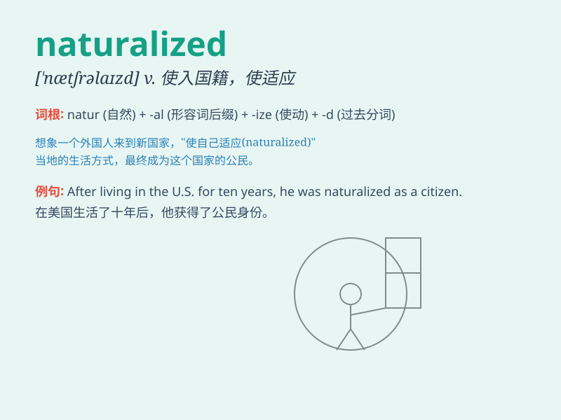

## naturalized

**英音:** _[ˈnætʃrəlaɪzd]_ **美音:** _[ˈnætʃrəˌlaɪzd]_

**译义:** *adj. 归化的；入籍的；自然化的 v.
使入国籍；使归化；使适应（naturalize的过去分词）*

### 短语

+ **naturalized citizen:** _归化公民_

+ **naturalized plant:** _归化植物_

+ **become naturalized:** _入籍；归化_

+ **naturalized species:** _归化种_

+ **naturalized habitat:** _归化生境_

### 例句

#### 例句1

> **He became a naturalized citizen of the United States last
year.**

**中文翻译:** 他去年成为了美国的入籍公民。

**单词释义:** 入籍的

#### 例句2

> **The naturalized plants adapted well to the local environment.**

**中文翻译:** 这些归化的植物很好地适应了当地环境。

**单词释义:** 归化的

#### 例句3

> **She is a naturalized athlete who now represents our country.**

**中文翻译:** 她是一位入籍运动员，现在代表我们国家。

**单词释义:** 入籍的

### 背诵小故事

> A foreign scientist worked hard and finally became naturalized. He
was so happy as he could fully contribute to the new country\'s
research. Now he felt truly at home.

**一位外国科学家努力工作，最终入籍了。他非常高兴，因为他可以全力为新的国家做研究了。现在他感觉真正像在家一样。**

### 图义

